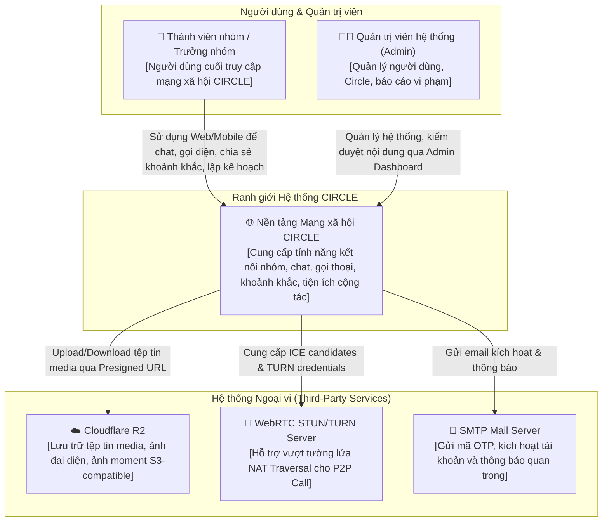
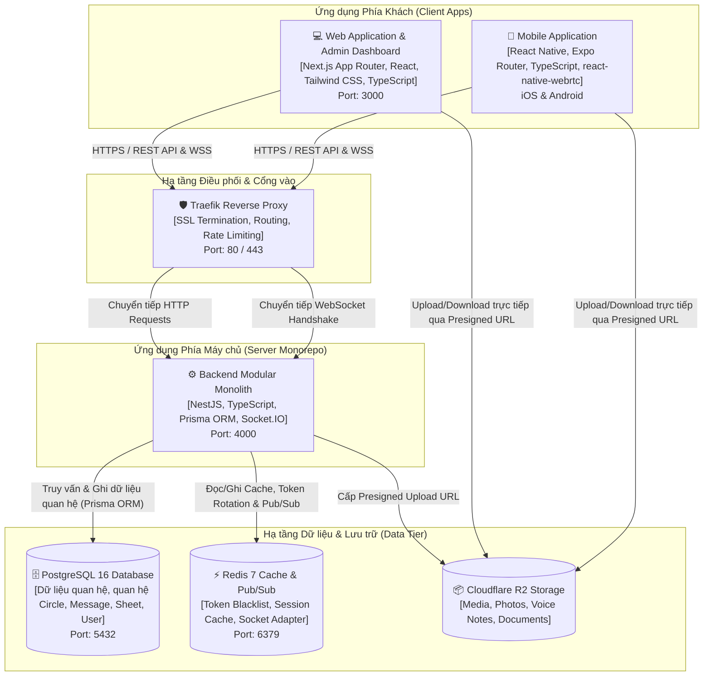
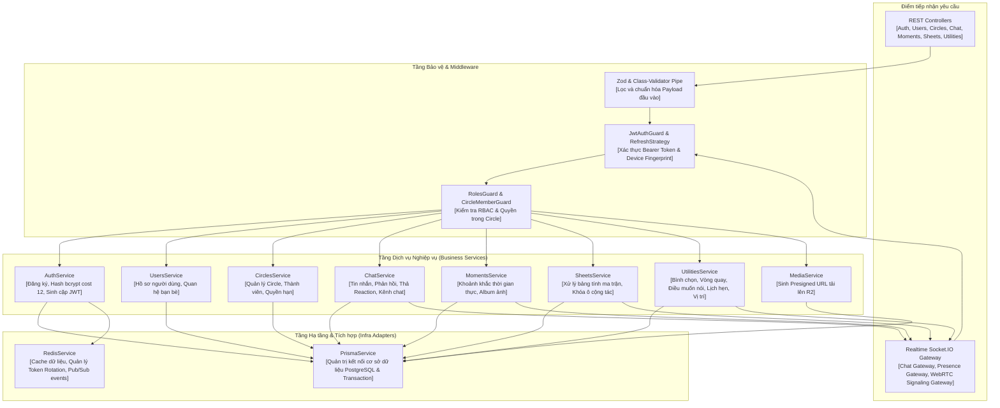

# CIRCLE — MÔ HÌNH KIẾN TRÚC C4 (C4 ARCHITECTURE MODEL)

> **Tài liệu thuộc phân hệ:** Architecture & Detailed Design của hệ thống CIRCLE.  
> **Căn cứ kế hoạch:** Kế hoạch thực hiện TLCN (Tuần 2 – 3 / Issue #12) & [`PROJECT_GOD.md`](../../../PROJECT_GOD.md).

---

## 1. Tổng quan Mô hình C4 (C4 Model Overview)

Hệ thống **CIRCLE** được mô hình hóa kiến trúc theo chuẩn **C4 Model** (Context, Containers, Components, Code) nhằm tạo ra các góc nhìn phân cấp rõ ràng từ bức tranh tổng thể đến cấu trúc thành phần mã nguồn:

1. **Level 1 — System Context (Ngữ cảnh hệ thống):** Xác định ranh giới hệ thống CIRCLE, người dùng tương tác và các dịch vụ bên thứ ba (External Services).
2. **Level 2 — Container Diagram (Mô hình khối chứa):** Mô tả các ứng dụng Client, máy chủ API Backend, Cơ sở dữ liệu và Hạ tầng lưu trữ/Cache.
3. **Level 3 — Component Diagram (Mô hình thành phần):** Bóc tách kiến trúc bên trong Modular Monolith Backend (NestJS), các Module nghiệp vụ và luồng dữ liệu nội bộ.
4. **Level 4 — Code Model:** Chi tiết hóa cấu trúc các lớp và thực thể miền nghiệp vụ (đã được đặc tả tại [`class-diagram.md`](./class-diagram.md) và [`classdiagram.puml`](./classdiagram.puml)).

---

## 2. C4 Level 1 — System Context Diagram (Ngữ cảnh Hệ thống)

Sơ đồ ngữ cảnh thể hiện hệ thống CIRCLE đóng vai trò hạt nhân kết nối người dùng, quản trị viên và các dịch vụ đám mây ngoại vi.

### Các tác nhân & Thành phần ngoại vi:
- **Thành viên nhóm / Trưởng nhóm (End User):** Tương tác nhóm tập trung theo từng Circle, nhắn tin realtime, gọi thoại/video, chia sẻ khoảnh khắc và phối hợp qua bảng kế hoạch ma trận.
- **Quản trị viên (Admin):** Sử dụng giao diện Web Admin (`/admin`) để theo dõi hệ thống, quản lý Circle, xử lý báo cáo vi phạm.
- **Cloudflare R2:** Dịch vụ lưu trữ đối tượng chuẩn S3, loại bỏ hoàn toàn chi phí băng thông tải ra (zero egress fee).
- **WebRTC STUN/TURN:** Thiết lập kết nối P2P âm thanh/hình ảnh khi các thiết bị nằm sau mạng NAT hoặc Firewall đối xứng.
- **SMTP Mail Server:** Dịch vụ gửi email thông báo xác thực tài khoản.

---

## 3. C4 Level 2 — Container Diagram (Mô hình Khối chứa)

Sơ đồ khối chứa thể hiện các ứng dụng phần mềm độc lập và kho dữ liệu tạo nên giải pháp CIRCLE:

### Chi tiết các Container:
1. **Web Application & Admin (`apps/web`):**
   - Công nghệ: Next.js 14+ (App Router), React, Tailwind CSS.
   - Vai trò: Giao diện web đa phản hồi (Responsive Shell: Left Rail, Channel Drawer, Main Stage) và cổng Quản trị viên tại `/admin`.
2. **Mobile Application (`apps/mobile`):**
   - Công nghệ: React Native, Expo Router, TypeScript.
   - Vai trò: Ứng dụng di động iOS/Android, hỗ trợ camera chụp Moment, SecureStore lưu token và WebRTC gọi thoại/video native.
3. **Backend API & Gateway (`apps/backend`):**
   - Công nghệ: NestJS Modular Monolith, Socket.IO Gateway, Prisma ORM.
   - Vai trò: Cung cấp REST API bảo mật, xác thực Dual-Token JWT, kiểm soát phân quyền RBAC và điều phối sự kiện thời gian thực.
4. **PostgreSQL 16:**
   - Lưu trữ dữ liệu nghiệp vụ quan hệ với tính toàn vẹn cao, composite indexes và cascade deletes.
5. **Redis 7:**
   - Quản lý phiên truy cập, blacklist thu hồi Refresh Token và đóng vai trò Socket.IO Redis Adapter khi mở rộng scale.
6. **Cloudflare R2:**
   - Lưu trữ phi cấu trúc (ảnh đại diện, ảnh moments, file đính kèm, tin nhắn thoại).

---

## 4. C4 Level 3 — Component Diagram (Mô hình Thành phần Backend)

Bóc tách chi tiết cấu trúc bên trong ứng dụng **Backend Modular Monolith (NestJS)**:

### Nguyên tắc tương tác thành phần:
- **Loose Coupling, High Cohesion:** Mỗi Module nghiệp vụ (`auth`, `circles`, `chat`, `moments`, `sheets`) chịu trách nhiệm trọn vẹn trong phạm vi miền nghiệp vụ của mình.
- **Thin Controllers, Rich Services:** Controller chỉ tiếp nhận request, ủy thác việc kiểm tra và thực thi nghiệp vụ hoàn toàn cho Service.
- **Realtime Bridging:** Khi các Service (như `ChatService`, `SheetsService`) ghi nhận thay đổi dữ liệu thành công xuống cơ sở dữ liệu qua `PrismaService`, chúng sẽ phát tín hiệu tới `SocketGateway` để đồng bộ tức thì cho các client đang mở kết nối.
- **Zero Secrets Leakage:** Thông tin nhạy cảm (JWT secret, DB URL, R2 credentials) được nạp qua `ConfigService` từ biến môi trường và không bao giờ xuất hiện lộ liễu trong mã nguồn.
