# CIRCLE — SƠ ĐỒ THỰC THỂ QUAN HỆ (ENTITY RELATIONSHIP DIAGRAM - ERD)

> **Tài liệu thuộc phân hệ:** Architecture & Database Design của hệ thống CIRCLE.  
> **Căn cứ mô hình miền nghiệp vụ:** [`class-diagram.md`](./class-diagram.md) & [`classdiagram.puml`](./classdiagram.puml).

---

## 1. Tổng quan Thiết kế Dữ liệu Quan hệ (ERD Overview)

Cơ sở dữ liệu của CIRCLE được triển khai trên **PostgreSQL 16** và quản lý thông qua **Prisma ORM**. Mô hình dữ liệu được tối ưu hóa cho bài toán mạng xã hội tương tác nhóm tập trung (**Circle-Centric**), với các ràng buộc khóa ngoại (Foreign Keys), hành vi xóa theo thác (Cascade Deletes) và chiến lược lập chỉ mục (Indexing Strategy) phục vụ truy vấn tải trang nhanh chóng.

---

## 2. Sơ đồ Thực thể Quan hệ (Mermaid ERD)

```mermaid
erDiagram
    %% ==========================================
    %% 1. ACCOUNT & SOCIAL
    %% ==========================================
    User ||--o| UserProfile : "owns"
    User ||--o{ RefreshToken : "has_sessions"
    User ||--o{ Friendship : "sends"
    User ||--o{ Friendship : "receives"
    User ||--o{ Notification : "receives"
    User ||--o{ CircleMember : "participates_as"

    User {
        string id PK
        string email UK
        string passwordHash
        boolean isActivated
        string globalRole
        datetime createdAt
        datetime updatedAt
        datetime deletedAt
    }

    UserProfile {
        string id PK
        string userId FK,UK
        string displayName
        string avatarUrl
        string coverUrl
        string bio
        datetime dateOfBirth
        datetime updatedAt
    }

    RefreshToken {
        string id PK
        string userId FK
        string tokenHash UK
        boolean isRevoked
        datetime expiresAt
        string userAgent
        string ipAddress
        datetime createdAt
    }

    Friendship {
        string id PK
        string senderId FK
        string receiverId FK
        string status
        datetime createdAt
        datetime updatedAt
    }

    Notification {
        string id PK
        string userId FK
        string title
        string content
        boolean isRead
        string type
        datetime createdAt
    }

    %% ==========================================
    %% 2. CIRCLE CORE & CHANNELS
    %% ==========================================
    Circle ||--|{ CircleMember : "has_members"
    Circle ||--o{ Channel : "has_channels"
    Circle ||--o{ SharedAlbum : "has_albums"
    Circle ||--o{ PlanningSheet : "has_sheets"
    Circle ||--o{ GroupPoll : "has_polls"
    Circle ||--o{ DecisionWheel : "has_wheels"
    Circle ||--o{ AnonymousPost : "has_confessions"
    Circle ||--o{ CalendarEvent : "has_events"
    Circle ||--o{ LiveLocationShare : "has_live_locations"
    Circle ||--o{ CallSession : "has_calls"
    Circle ||--o{ Moment : "stores_moments"

    Circle {
        string id PK
        string name
        string avatarUrl
        string coverUrl
        string description
        string inviteCode UK
        boolean isPrivate
        datetime createdAt
        datetime updatedAt
        datetime deletedAt
    }

    CircleMember {
        string id PK
        string circleId FK
        string userId FK
        string role
        string nickname
        datetime joinedAt
        datetime updatedAt
    }

    Channel {
        string id PK
        string circleId FK
        string name
        string type
        string topic
        datetime createdAt
        datetime updatedAt
    }

    %% ==========================================
    %% 3. MESSAGES & MOMENTS
    %% ==========================================
    Channel ||--o{ Message : "contains_messages"
    CircleMember ||--o{ Message : "sends_message"
    Message ||--o{ Reaction : "receives"
    Message ||--o| PinnedRecord : "is_pinned"
    Message ||--o{ Message : "replies_to"

    Message {
        string id PK
        string channelId FK
        string memberId FK
        string type
        string content
        string fileUrl
        string fileName
        int fileSize
        int audioDuration
        string replyToId FK
        datetime sentAt
        datetime updatedAt
        datetime deletedAt
    }

    Reaction {
        string id PK
        string messageId FK
        string momentId FK
        string memberId FK
        string emoji
        datetime createdAt
    }

    Moment ||--o| Photo : "contains"
    Moment ||--o{ Reaction : "receives"
    CircleMember ||--o{ Moment : "captures"

    Moment {
        string id PK
        string circleId FK
        string memberId FK
        string caption
        datetime capturedAt
        datetime createdAt
    }

    Photo {
        string id PK
        string momentId FK,UK
        string sharedAlbumId FK
        string fileUrl
        int width
        int height
        datetime createdAt
    }

    SharedAlbum ||--o{ Photo : "contains_photos"

    SharedAlbum {
        string id PK
        string circleId FK
        string albumTitle
        datetime createdAt
        datetime updatedAt
    }

    %% ==========================================
    %% 4. COLLABORATIVE PLANNING SHEET
    %% ==========================================
    PlanningSheet ||--|{ SheetColumn : "has_columns"
    PlanningSheet ||--o{ SheetRow : "has_rows"
    SheetRow ||--|{ SheetCell : "contains_cells"
    SheetColumn ||--o{ SheetCell : "locates_cells"

    PlanningSheet {
        string id PK
        string circleId FK
        string createdById FK
        string title
        datetime createdAt
        datetime updatedAt
    }

    SheetColumn {
        string id PK
        string sheetId FK
        int columnIndex
        string columnTitle
        datetime createdAt
    }

    SheetRow {
        string id PK
        string sheetId FK
        int rowIndex
        datetime createdAt
    }

    SheetCell {
        string id PK
        string rowId FK
        string columnId FK
        string cellValue
        string lastEditedById FK
        datetime updatedAt
    }

    %% ==========================================
    %% 5. CIRCLE UTILITIES
    %% ==========================================
    GroupPoll ||--|{ PollOption : "has_options"
    GroupPoll ||--o{ PollVote : "has_votes"
    PollOption ||--o{ PollVote : "selected_in"

    GroupPoll {
        string id PK
        string circleId FK
        string question
        datetime deadline
        boolean isClosed
        datetime createdAt
    }

    PollOption {
        string id PK
        string pollId FK
        string optionText
        int orderIndex
    }

    PollVote {
        string id PK
        string pollId FK
        string optionId FK
        string memberId FK
        datetime votedAt
    }

    DecisionWheel ||--|{ WheelOption : "has_options"

    DecisionWheel {
        string id PK
        string circleId FK
        string title
        datetime createdAt
    }

    WheelOption {
        string id PK
        string wheelId FK
        string optionLabel
        string color
    }

    AnonymousPost {
        string id PK
        string circleId FK
        string content
        datetime postedAt
    }

    CalendarEvent {
        string id PK
        string circleId FK
        string createdById FK
        string eventTitle
        string description
        datetime startTime
        datetime endTime
        datetime reminderTime
        datetime createdAt
    }

    LiveLocationShare {
        string id PK
        string circleId FK
        string memberId FK
        float latitude
        float longitude
        int shareDuration
        datetime expiresAt
        boolean isActive
        datetime updatedAt
    }

    CallSession ||--|{ CallParticipant : "has_participants"

    CallSession {
        string id PK
        string circleId FK
        string callType
        string status
        datetime startedAt
        datetime endedAt
    }

    CallParticipant {
        string id PK
        string callSessionId FK
        string memberId FK
        datetime joinedAt
        datetime leftAt
    }
```

