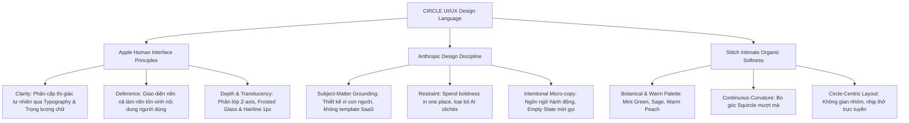

# CIRCLE — UI/UX Design Language Specification

> **Tài liệu đặc tả Ngôn ngữ Thiết kế UI/UX Nền tảng CIRCLE**  
> *Được hợp nhất từ: Triết lý Human Interface Guidelines (Apple) · Hệ thống Intimate Circles (Google Stitch) · Tiêu chuẩn Thiết kế Chống Rập khuôn AI (Anthropic Frontend Design).*  
> **Trạng thái:** Active / Single Source of Truth for UI/UX · **Phạm vi:** Next.js Web (`apps/web`), Integrated Admin, React Native Expo Mobile (`apps/mobile`).

---

## 1. Triết lý Thiết kế Cốt lõi (Design Philosophy)

CIRCLE là một mạng xã hội kết nối nhóm thân mật (**Intimate Group Connectivity**), hướng đến sự kết nối chân thật, an toàn tâm lý và không bị chi phối bởi các thuật toán câu tương tác (anti-algorithmic sanctuary).

Ngôn ngữ thiết kế của CIRCLE được định hình bởi **3 trụ cột triết lý lớn**:



### 1.1. Tinh hoa Apple Human Interface Guidelines (HIG)
1. **Clarity (Sự rõ ràng & Sắc nét):** 
   - Typography là linh hồn giao diện. Phân định cấp bậc nội dung thông qua kích thước và độ đậm nhạt (`font-weight`) có chủ đích, thay vì bao bọc mọi thứ trong các đường viền hay ô hộp thừa thãi.
   - Khoảng trắng (Negative Space) được sử dụng hào phóng để tạo nhịp thở thị giác, giúp người dùng tập trung vào cuộc trò chuyện mà không cảm thấy ngột ngạt.
2. **Deference (Tôn trọng nội dung):** 
   - Giao diện không tranh giành sự chú ý với nội dung của người dùng. Các thanh điều hướng, thanh bên và khung điều khiển chỉ đóng vai trò hỗ trợ, rút lui về phía sau để hình ảnh kỷ niệm, tin nhắn và âm thanh cuộc gọi trở thành tâm điểm.
3. **Depth & Materials (Chiều sâu & Vật liệu):** 
   - Không sử dụng đổ bóng thô kệch (shadow đen đậm). Chiều sâu được tạo dựng qua các lớp vật liệu mờ ảo (*Translucent Frosted Glass / Backdrop Blur*), đường viền sợi chỉ siêu mảnh (*Hairline Border 0.5px – 1px*) và hiệu ứng ánh sáng tán xạ (*Ambient Light Diffusion*).
4. **Direct Manipulation & Tactile Fluidity (Cảm giác vật lý trực quan):** 
   - Bo góc theo đường cong hữu cơ liên tục (*Continuous Corner Radius / Squircle*).
   - Tương tác chạm và nhấp chuột có độ lún đàn hồi (*Micro-press scale 0.98*) mang lại phản hồi xúc giác nhẹ nhàng, tinh tế.

### 1.2. Kỷ luật Thiết kế Anthropic Frontend Design
- **Tuyệt đối tránh các lối mòn AI (AI Tells / Clichés):**
  - ❌ *Không* dùng bảng màu AI mặc định (nền kem nhạt `#F4F1EA` + cam đất `#D97757`).
  - ❌ *Không* băm nhỏ giao diện thành các card bo góc rập khuôn với bóng mờ đơn điệu `rgba(0,0,0,0.1)`.
  - ❌ *Không* lạm dụng nhãn ALL-CAPS với tracking rộng, không chèn metadata dấu chấm `A · B · C` vô thức.
  - ❌ *Không* đánh số `01 / 02 / 03` trang trí trừ khi đó thực sự là quy trình tuần tự.
  - ❌ *Không* gắn animation fade-in / slide-up ở khắp mọi component gây cảm giác rẻ tiền.
- **Tiết chế tối đa ("Spend your boldness in one place"):** 
  - Trong mỗi màn hình, chỉ chọn đúng **một** điểm nhấn đáng nhớ nhất (ví dụ: khoảnh khắc album kỷ niệm, sóng âm thanh voice call, hoặc thiệp tâm sự "Điều muốn nói"), các chi tiết còn lại phải giữ sự tĩnh lặng và kỷ luật.
- **Micro-copywriting chuẩn mực:** 
  - Nút bấm luôn dùng động từ hành động cụ thể (`Lưu thay đổi`, `Rời vòng tròn` thay vì `Submit`).
  - Trạng thái rỗng (*Empty State*) đóng vai trò là lời mời gọi kết nối, không phải màn hình thông báo cụt lủn.

### 1.3. Bản sắc Hữu cơ Google Stitch (Intimate Circles)
- Tông màu lấy cảm hứng từ thảo mộc thiên nhiên (bạc hà, cây xô thơm, đất nung ấm, đào mơ), tạo cảm giác ấm cúng, chữa lành và thư giãn tinh thần.
- Biểu tượng hình tròn xuyên suốt — từ avatar thành viên đến chỉ báo trạng thái nhịp thở trực tuyến (*Breathing Pulse Presence Dot*).

---

## 2. Hệ thống Design Tokens (Design Tokens Specification)

### 2.1. Bảng màu (Color Palette)

CIRCLE thay thế hoàn toàn màu đen gắt (`#000000`) và xám kim loại bằng các tone màu hữu cơ sâu thẳm:

| Token Name | Hex Code | Vai trò trong giao diện | Tiêu chuẩn tương phản (WCAG) |
|---|---|---|---|
| `--color-primary` | `#78C6A3` | **Mint Pastel**: Màu nhận diện thương hiệu, nút CTA chính, huy hiệu tích cực | AA Large Text / Interactive anchor |
| `--color-primary-dark` | `#4FA982` | **Forest Sage**: Trạng thái hover/active, focus ring, viền active, icon chính | AAA với nền trắng / AA Normal Text |
| `--color-primary-wash` | `#DDF3E8` | **Mint Wash**: Nền chip được chọn, halo hiệu ứng online, nền badge | Nền bề mặt nhẹ nhàng |
| `--color-accent-warm` | `#F4C7A1` | **Warm Peach**: Thẻ "Điều muốn nói", thiệp kỷ niệm, reaction chúc mừng | Điểm nhấn cảm xúc không gây căng thẳng |
| `--color-text-main` | `#24332C` | **Charcoal Forest**: Màu chữ chính cho toàn bộ tiêu đề và nội dung đọc | 13.8:1 trên nền trắng (AAA Vượt chuẩn) |
| `--color-text-muted` | `#718078` | **Muted Slate Green**: Chữ phụ, thời gian (timestamp), nhãn mô tả, placeholder | 4.8:1 trên nền trắng (AA Normal Text) |
| `--color-canvas` | `#F7FAF8` | **Botanical Off-White**: Nền toàn trang, ấm áp dịu mắt thay cho trắng tinh | Canvas chuẩn |
| `--color-surface` | `#FFFFFF` | **Pure White**: Bề mặt thẻ (cards), thanh điều hướng, modal popover | Surface chuẩn |
| `--color-surface-warm` | `#FFF9F4` | **Warm Ivory**: Bề mặt đặc biệt cho thẻ ghi chú ẩn danh / khoảnh khắc riêng | Emotional Card Surface |
| `--color-hairline` | `#E5ECE8` | **Subtle Sage Line**: Đường phân chia siêu mảnh (0.5px / 1px), viền container | Không gây ô hộp thị giác |
| `--color-danger` | `#E98282` | **Soft Coral**: Nút hủy, rời nhóm, thông báo lỗi (thấu cảm, không dọa dẫm) | AA Compliant |

```
/* Tailwind CSS Token Mapping (tailwind.config.ts) */
colors: {
  circle: {
    primary: '#78C6A3',
    sage: '#4FA982',
    wash: '#DDF3E8',
    peach: '#F4C7A1',
    charcoal: '#24332C',
    slate: '#718078',
    canvas: '#F7FAF8',
    surface: '#FFFFFF',
    ivory: '#FFF9F4',
    hairline: '#E5ECE8',
    coral: '#E98282',
  }
}
```

---

### 2.2. Hệ thống Typography (Apple Scale với Plus Jakarta Sans)

CIRCLE chọn font chữ độc quyền là **`Plus Jakarta Sans`** cho toàn bộ Web và Mobile. Font chữ này kết hợp hoàn hảo giữa độ chính xác hình học hiện đại của *SF Pro* (Apple) và sự mềm mại, thân thiện ở các đầu nét uốn cong:

| Cấp bậc (Role) | Kích thước (Desktop) | Kích thước (Mobile) | Font Weight | Line Height | Tracking (Letter Spacing) | Mục đích sử dụng |
|---|---|---|---|---|---|---|
| **Display** | 2.5rem (40px) | 2.0rem (32px) | Bold (700) | 1.2 | -0.02em | Màn hình giới thiệu, tên Circle nổi bật |
| **Large Title** | 2.0rem (32px) | 1.625rem (26px) | Semibold (600) | 1.25 | -0.015em | Tiêu đề trang chính (Web/Mobile) |
| **Title 1** | 1.5rem (24px) | 1.375rem (22px) | Semibold (600) | 1.3 | -0.01em | Tên nhóm, tiêu đề module, modal header |
| **Title 2** | 1.25rem (20px) | 1.125rem (18px) | Semibold (600) | 1.35 | 0em | Tiêu đề card, tên section, username |
| **Headline** | 1.0rem (16px) | 1.0rem (16px) | Semibold (600) | 1.4 | 0em | Tiêu đề bài viết ngắn, tên người gửi |
| **Body (Default)** | 0.9375rem (15px) | 0.9375rem (15px) | Regular (400) | 1.55 | +0.01em | Nội dung tin nhắn chat, ghi chú, bình luận |
| **Body Large** | 1.0625rem (17px) | 1.0rem (16px) | Regular (400) | 1.6 | +0.01em | Đoạn tâm sự dài trong "Điều muốn nói" |
| **Callout** | 0.875rem (14px) | 0.875rem (14px) | Medium (500) | 1.4 | +0.015em | Dòng trạng thái, chú thích quan trọng |
| **Footnote** | 0.8125rem (13px) | 0.8125rem (13px) | Regular (400) | 1.35 | +0.02em | Metadata, timestamp, dung lượng file |
| **Caption** | 0.75rem (12px) | 0.6875rem (11px) | Semibold (600) | 1.3 | +0.03em | Nhãn badge, pill trạng thái nhỏ |

> **Nguyên tắc Typographic của Apple:**
> - Không bôi đậm ngẫu hứng từng từ trong câu.
> - Giới hạn độ dài dòng đọc tối ưu: **Dưới 75 ký tự/dòng** để mắt không bị mỏi.
> - Không dùng ALL-CAPS cho nhãn văn bản dài; chỉ dùng chữ thường theo câu (*Sentence case*).

---

### 2.3. Bán kính Bo góc (Continuous Squircle Radii)

Áp dụng phong cách bo góc mượt mà kiểu iOS/macOS (Squircle curvature) thay cho các góc vuông sắc nhọn:

| Token | Giá trị | Ứng dụng cụ thể |
|---|---|---|
| `rounded-sm` | `0.5rem` (8px) | Checkbox, tooltips nhỏ, hình ảnh đính kèm thumbnail |
| `rounded-md` | `0.75rem` (12px) | Menu dropdown, popover menu, tag item |
| `rounded-xl` | `1.25rem` (20px) | Bong bóng chat nhóm, ô nhập liệu tin nhắn (input bar) |
| `rounded-2xl` | `1.5rem` (24px) | Thẻ bài viết (post card), widget mini, danh sách thành viên |
| `rounded-3xl` | `2.0rem` (32px) | Khung Modal dialog, Bottom Sheet (Mobile), Panel gọi video |
| `rounded-full` | `9999px` | Nút bấm (Pill buttons), chip bộ lọc, avatar thành viên, badge |

---

### 2.4. Chiều sâu, Vật liệu & Đổ bóng (Materials, Blur & Elevation)

Tuân thủ nghiêm ngặt nguyên tắc **Deference & Depth** của Apple: Không dùng bóng đen đặc thô ráp, sử dụng bóng tán xạ đa lớp kết hợp hiệu ứng kính mờ (Translucent Materials).

```css
/* CIRCLE Elevation & Materials */

/* Level 0: Nền sàn phẳng */
--bg-canvas: #F7FAF8;

/* Level 1: Thẻ phẳng & Khối chứa (Hairline 1px + Tán xạ siêu êm) */
--surface-card: #FFFFFF;
border: 1px solid #E5ECE8;
box-shadow: 0 2px 8px -2px rgba(36, 51, 44, 0.04);

/* Level 2: Thẻ tương tác khi Hover / Dropdown nổi */
--surface-floating: #FFFFFF;
border: 1px solid #E5ECE8;
box-shadow: 0 10px 25px -4px rgba(36, 51, 44, 0.08), 
            0 4px 10px -2px rgba(36, 51, 44, 0.03);

/* Level 3: Modal Dialog / Bottom Sheet / Call Screen HUD */
--surface-modal: #FFFFFF;
border: none;
box-shadow: 0 20px 48px -8px rgba(36, 51, 44, 0.14);

/* Apple Frosted Glass Material (Dành cho Header, Navigation Bar & Call HUD) */
background: rgba(255, 255, 255, 0.82);
backdrop-filter: blur(16px) saturate(180%);
-webkit-backdrop-filter: blur(16px) saturate(180%);
border-bottom: 1px solid rgba(229, 236, 232, 0.6);
```

---

## 3. Kiến trúc Layout & Hệ thống Lưới (Layout System)

### 3.1. Desktop Web Layout (Next.js `apps/web` — Màn hình $\ge$ 1200px)
Bố cục 3 cột bất đối xứng thanh lịch, duy trì sự gắn kết ngay cả trên màn hình Ultrawide bằng cách cố định chiều rộng nội dung tối đa (`max-w-[1360px]` căn giữa):

```
+-----------------------------------------------------------------------------------------+
| [Top Frosted Bar]  Logo Circle  |  Tên Vòng Tròn Hiện Tại  |  Search & User Profile      |
+-----------------------------------------------------------------------------------------+
| [Left Navigation Rail]   | [Central Intimate Stream]         | [Right Presence & Rails] |
| 280px Fixed              | 680px Max Fluid Stream            | 320px Fixed              |
|                          |                                   |                          |
| - Danh sách Circle       | - Banner nhóm & nhịp thở          | - Thành viên online (có  |
| - Kênh Chat / Thảo luận  | - Dòng sự kiện / Tin nhắn         |   breathing halo pulse)  |
| - Album kỷ niệm          | - Thiệp "Điều muốn nói"           | - Lịch hẹn sắp tới       |
| - Planning Sheet         | - Khung soạn thảo tin nhắn        | - Nút gọi thoại / video  |
| - Cài đặt nhóm           |   (Pill rounded-full input)       |   nhanh vào phòng chung  |
+-----------------------------------------------------------------------------------------+
```

### 3.2. Tablet Layout (768px – 1199px)
- Cột bên phải (Right Rail) tự động thu gọn thành một thanh trượt nổi (*Slide-over Drawer*) hoặc Popover khi nhấn vào icon thành viên trên Header.
- Cột giữa mở rộng chiếm trọn không gian để tối ưu trải nghiệm đọc tin nhắn và xem ảnh.

### 3.3. Mobile Layout (React Native Expo `apps/mobile` — Dưới 768px)
- **1-Column Native Flow:** Tối ưu hóa cho ngón tay cái (*Thumb Zone*).
- **Floating Pill Navigation Bar:** Thanh điều hướng nổi dạng viên thuốc bo tròn (`rounded-full`) đặt cách đáy màn hình 16px, áp dụng vật liệu kính mờ Apple Frosted Glass.
- **Gesture-driven:** Vuốt từ mép trái để quay lại (*Interactive Pop Gesture*), vuốt xuống để đóng Modal/Sheet (*Pull-to-dismiss*).

---

## 4. Đặc tả Chi tiết Thành phần UI/UX (Component Specs)

### 4.1. Nút bấm (Buttons)
- **Primary Pill Action (`btn-primary`):** 
  - Nền `#78C6A3`, chữ `#24332C` (Semibold), bo góc `rounded-full`.
  - Padding: `px-6 py-3` (Desktop) / `px-7 py-3.5` (Mobile - độ cao tối thiểu 44px chuẩn Apple touch target).
  - Hover: Chuyển mượt sang `#4FA982`, chữ `#FFFFFF`.
  - Active: Thu nhỏ nhẹ nhàng `scale(0.98)` với hiệu ứng lò xo (`transition: transform 0.15s cubic-bezier(0.2, 0.8, 0.2, 1)`).
- **Secondary Tone Action (`btn-secondary`):**
  - Nền `#DDF3E8`, chữ `#4FA982`, không viền, `rounded-full`.
  - Dùng cho các hành động phụ trong nhóm (Tạo bình chọn, Đính kèm ảnh).
- **Heartfelt / Warm Action (`btn-warm`):**
  - Nền `#F4C7A1`, chữ `#24332C`, `rounded-full`. Dành riêng cho luồng gửi tâm sự bí mật "Điều muốn nói" hoặc tạo thiệp chúc mừng.
- **Destructive Action (`btn-danger`):**
  - Nền trong suốt hoặc `#FFF0F0`, chữ `#E98282`, viền mềm `1px solid #FCD4D4`.

---

### 4.2. Avatar & Chỉ báo Trạng thái Nhịp thở (Breathing Pulse Presence Dot)
- Avatar luôn luôn là **hình tròn hoàn hảo (`rounded-full`)**, viền sợi chỉ mỏng `1.5px` trắng để tách lớp khỏi nền.
- **Trạng thái Trực tuyến (Online Indicator):**
  - Đặt ở góc dưới bên phải avatar (kích thước 10px).
  - Màu xanh mint `#78C6A3` kèm vòng lan tỏa nhịp thở êm đềm (CSS animation `pulse-gentle` chu kỳ 3.2 giây):
  ```css
  @keyframes presence-breathe {
    0%, 100% { box-shadow: 0 0 0 0 rgba(120, 198, 163, 0.4); }
    50% { box-shadow: 0 0 0 6px rgba(120, 198, 163, 0); }
  }
  ```
  - Thay vì cảm giác sốt ruột của các chấm xanh neon thông thường, hiệu ứng này đem lại cảm giác yên bình, nhẹ nhàng báo hiệu người bạn thân đang hiện diện.

---

### 4.3. Thẻ "Điều muốn nói" (Anonymous Reflection Card)
Một tính năng văn hóa độc đáo của CIRCLE giúp các thành viên chia sẻ suy nghĩ chân thật:
- **Bề mặt:** Nền kem ấm `#FFF9F4` (*Warm Ivory*), viền sợi chỉ mềm `#F4C7A1`.
- **Typography:** Font `body-lg` với `line-height: 1.65`, tạo cảm giác như đọc một lá thư tay gửi gắm tâm tình trên trang giấy ấm áp.
- **Nhãn phân loại:** Không dùng All-caps gắt gỏng, chỉ có một icon lá thư nhỏ cùng dòng chú thích dịu dàng: *"Lời nhắn gửi ẩn danh đến vòng tròn"*.

---

### 4.4. Phòng Gọi Voice / Video WebRTC HUD
- Giao diện phòng gọi áp dụng triết lý điện ảnh tối giản của Apple FaceTime:
  - Video feed bo tròn `rounded-3xl` với tỷ lệ khung hình tự nhiên.
  - Thanh công cụ điều khiển cuộc gọi nổi ở đáy màn hình dạng viên thuốc kính mờ đen sâu (`rgba(36, 51, 44, 0.85)` + `backdrop-blur-xl`), các nút chức năng (Mic, Camera, Màn hình, Rời phòng) dạng hình tròn tối giản với icon sáng rõ.
  - Sóng âm thanh giọng nói (*Audio Visualizer Wave*) sử dụng màu `#78C6A3` nhảy múa mềm mại khi thành viên cất lời.

---

## 5. Quy chuẩn Thiết kế Đa nền tảng (Web vs. Mobile)

| Tiêu chí | Next.js Web (`apps/web`) | React Native Expo Mobile (`apps/mobile`) |
|---|---|---|
| **Điều hướng chính** | Left Sidebar + Header cố định kính mờ | Floating Bottom Pill Tab Bar |
| **Touch / Click Target** | Tối thiểu 36px | Tối thiểu 44px $\times$ 44px (chuẩn Apple HIG) |
| **Phản hồi xúc giác** | CSS micro-scaling (`scale-98`) khi bấm | Expo Haptics (`Haptics.impactAsync(Light)`) |
| **Modal & Form** | Centered Dialog với backdrop mờ 4px | Apple-style Bottom Sheet kéo vuốt cử chỉ |
| **Typography Engine** | `next/font/google` (Plus Jakarta Sans) | Expo Font / Google Fonts nạp sẵn |
| **Cuộn trang** | Smooth subtle scrollbar (ẩn khi không cuộn) | Native iOS Inertial Bounce Scroll |

---

## 6. Danh mục Kiểm tra Thực thi (DoD for UI Implementation)

Trước khi gửi bất kỳ Pull Request nào liên quan đến UI/UX, kỹ sư và AI Agent phải đối chiếu danh sách sau:
- [ ] **Bảng màu:** Đã dùng đúng tokens (`circle.primary`, `circle.charcoal`, `circle.canvas`), không hardcode mã màu lạ.
- [ ] **Contrast Check:** Chữ trên nền đạt tối thiểu tỉ lệ 4.5:1 (đã kiểm tra WCAG AA).
- [ ] **Typography:** Dùng đúng font `Plus Jakarta Sans`, không dùng ALL-CAPS cho câu dài, cỡ chữ không nhỏ hơn 11px.
- [ ] **Tránh AI Clichés:** Không dùng card rập khuôn với shadow đen, không animation nhảy múa thừa thãi.
- [ ] **Khoảng trống ngón tay (Mobile):** Mọi nút bấm và icon có thể chạm đều có diện tích tối thiểu $44 \times 44$ pt.
- [ ] **Micro-copy:** Nút bấm dùng động từ hành động cụ thể, thông điệp lỗi rõ ràng hướng dẫn cách khắc phục.
- [ ] **Vật liệu:** Các thanh cố định nổi (Header/Tab bar) có hiệu ứng kính mờ `backdrop-blur`.

---
*Tài liệu này là chuẩn mực thiết kế bắt buộc cho đề tài tốt nghiệp CIRCLE. Mọi đề xuất thay đổi cần thông qua thảo luận và cập nhật theo quy trình PR Peer Review.*
