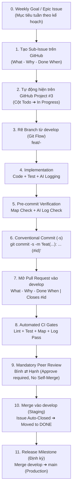
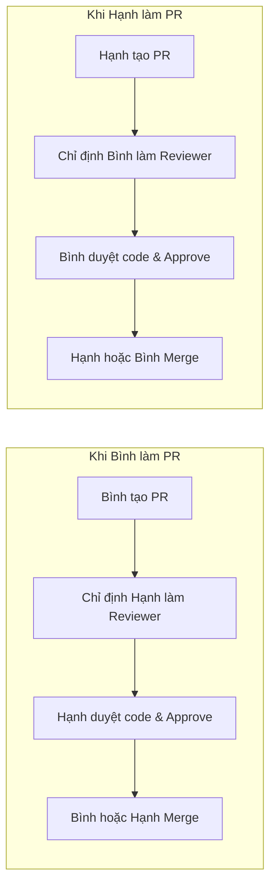

# CIRCLE Engineering Workflow & Standard Operating Procedure (SOP)

> **Mục tiêu tối thượng:** Đảm bảo toàn bộ quá trình phát triển của **Trương Công Bình (23110184)** và **Ninh Thị Mỹ Hạnh (23110210)** tuân thủ 100% các tiêu chí khắt khe nhất của [`PROJECT_GOD.md`](../../PROJECT_GOD.md), vượt qua **10 Hard Gates**, đạt điểm tối đa **Level 5 Rubric (Điểm 10)** và phục vụ bảo vệ Khóa luận/Tiểu luận Chuyên ngành.

---

## 1. Sơ đồ Tổng thể Quy trình (End-to-End Lifecycle)



---

## 2. Giai đoạn 1: Quản trị Issue & Chuẩn bị (Issue Governance & Pre-flight)

### Bước 1.1: Quy tắc "Mọi thay đổi đều bắt buộc đi kèm Issue"
> [!IMPORTANT]
> **LUẬT BẤT BIẾN:** Tuyệt đối không viết code, không commit, và không mở PR nếu chưa có Issue tương ứng. Mọi lỗi (bug), tính năng mới (feat), công việc kỹ thuật (task) hay tài liệu (docs) đều phải được định danh bằng một Issue cụ thể.

1. **Phân cấp 2 tầng Issue (Issue Hierarchy):**
   - **Tầng 1 — Weekly Goal / Epic Issue (`[GOAL-WXX]: ...`):** Đại diện cho mục tiêu lớn của từng tuần theo Kế hoạch thực hiện TLCN ([`docs/Ke hoach thuc hien TLCN .md`](../Ke%20hoach%20thuc%20hien%20TLCN%20.md)). Issue này quản lý danh sách các việc con trong tuần.
   - **Tầng 2 — Sub-issues / Task Issues (`[FEAT]`, `[BUG]`, `[TASK]`):** Các thay đổi cụ thể để hoàn thành mục tiêu tuần. Mỗi sub-issue liên kết trực tiếp với Weekly Goal cha (`Parent: #<epic_id>`).
2. **Tự động đồng bộ với GitHub Project:**
   - Mỗi khi một Issue được mở trên GitHub, nó sẽ tự động xuất hiện trên bảng quản trị dự án: **[CIRCLE — Project OS (#3)](https://github.com/users/1440isme/projects/3)** ở cột **Todo**.
   - Khi kỹ sư bắt đầu làm việc: Gán bản thân vào **Assignees** và kéo thẻ sang cột **In Progress**.

### Bước 1.2: Cấu trúc mô tả bắt buộc của Issue (What — Why — Done When)
Mọi Issue tạo ra phải có phần Description rõ ràng theo 3 câu hỏi chuẩn:
- **1. What:** Mô tả cụ thể tính năng, lỗi hoặc công việc kỹ thuật cần làm là gì?
- **2. Why:** Tại sao cần làm việc này? Giá trị mang lại cho người dùng / nhóm Circle là gì?
- **3. Done When (Acceptance Criteria):** Điều kiện hoàn thành cụ thể là gì? (Liệt kê các tiêu chí kiểm chứng rõ ràng `[ ] AC-xxx-01`, `[ ] AC-xxx-02`).

### Bước 1.3: Mô hình Môi trường & Chiến lược Nhánh (Git Flow Branching)
Dự án áp dụng mô hình phân tách môi trường nghiêm ngặt:
- **`main` (Production):** Môi trường sản phẩm thực tế, chạy ổn định, chỉ nhận merge từ `dev` khi kết thúc milestone/release và đã qua kiểm thử toàn diện.
- **`dev` (`develop` - Staging / Integration):** Môi trường tích hợp chính. **Mọi nhánh tính năng khi hoàn thành đều bắt buộc MERGE VÀO NHÁNH `dev`**.
- **Quy tắc rẽ nhánh:** Tuyệt đối không code trực tiếp trên `main` hoặc `dev`. Luôn kéo mã nguồn mới nhất từ `dev` trước khi tạo nhánh:

```bash
# 1. Chuyển về nhánh develop và kéo code mới nhất
git checkout develop
git pull origin develop

# 2. Tạo nhánh mới theo chuẩn quy ước (rẽ từ develop)
git checkout -b <type>/<issue_id>-<slug>
```

#### Quy tắc đặt tên Branch:
| Loại công việc (`<type>`) | Ý nghĩa | Ví dụ thực tế |
|---|---|---|
| `feat/` | Tính năng mới (User Story) | `feat/1-auth-user-registration` |
| `fix/` | Sửa lỗi phát sinh (Bug) | `fix/14-jwt-token-expiration` |
| `test/` | Bổ sung test tự động | `test/20-chat-gateway-e2e` |
| `docs/` | Viết tài liệu, báo cáo | `docs/25-srs-functional-matrix` |
| `refactor/` | Tái cấu trúc code (không đổi behavior) | `refactor/30-prisma-query-optimization` |
| `infra/` | CI/CD, Docker, Git Hooks | `infra/5-github-actions-pipeline` |
| `spike/` | Nghiên cứu công nghệ (PoC) | `spike/7-webrtc-signaling-poc` |

---

## 3. Giai đoạn 2: Trong quá trình Code (Implementation & Quality Gates)

### Bước 2.1: Phân tầng Kiến trúc (Code Placement)
Đặt code đúng vị trí theo kiến trúc Monorepo:
- **Backend API (NestJS + Prisma):** `apps/backend/`
- **Web App & Admin (Next.js):** `apps/web/` (Admin nằm tại `apps/web/src/app/admin/`)
- **Mobile App (React Native Expo):** `apps/mobile/`
- **Thư viện dùng chung:** `packages/types/`, `packages/shared/`, `packages/config/`

### Bước 2.2: Quy chuẩn Chất lượng & Bảo mật (Hard Gates G5, G7)
- **Bảo mật (Gate G7):**
  - Mật khẩu phải hash bằng bcrypt cost 12.
  - Tuyệt đối không commit file bí mật: `.env`, `.env.local`, API keys, private certs.
  - Mọi endpoint nhận input từ client đều phải qua `ValidationPipe` và class-validator DTO.
- **Kiểm thử tự động (Gate G5):**
  - Viết Unit Test song song trong file `*.spec.ts`.
  - Đảm bảo kiểm thử pass 100% trước khi commit:
    ```bash
    cd apps/backend && npm test
    cd apps/web && npm run build
    ```

### Bước 2.3: Đồng bộ Sitemaps & Tài liệu
- Nếu bạn tạo thêm route hoặc màn hình:
  - Cập nhật danh sách trang tại [`.agents/SITEMAP.md`](../../.agents/SITEMAP.md).
- Chạy script kiểm tra link nội bộ để tránh lỗi gãy liên kết (Map Drift):
  ```bash
  bash scripts/check-agent-map.sh
  ```

### Bước 2.4: Ghi nhận Nhật ký AI (Hard Gate G3 — Inviolable)
- Nếu có sử dụng AI (Antigravity IDE, Claude Code, ChatGPT, GitHub Copilot,...):
  - Phải có mục `AI-XXXX` tương ứng được ghi nhận vào [`docs/ai-usage/log.md`](../ai-usage/log.md).
  - Khai báo trung thực: Tool, Model, Prompt Summary, Files Affected, Lỗi/Ảo giác (nếu có).

---

## 4. Giai đoạn 3: Commit Mã nguồn (Commitment Standards)

### Bước 3.1: Định dạng Conventional Commits chuẩn quốc tế
Mỗi commit phải trả lời được: Làm gì? Thuộc scope nào? Phục vụ cho Task (Issue) nào?

```
<type>(<scope>): <mô_tả_ngắn_gọn> (#<issue_id>)

[tùy chọn: thân commit giải thích chi tiết lý do và giải pháp]

Signed-off-by: Full Name <email@student.hcmute.edu.vn>
```

#### Các Scope hợp lệ:
`auth`, `circles`, `chat`, `realtime`, `media`, `web`, `mobile`, `admin`, `infra`, `docs`.

#### Ví dụ commit chuẩn:
```bash
# Đang làm dở, liên kết commit vào dòng thời gian của Issue #1
git commit -s -m "feat(auth): add bcrypt password hashing logic (#1)"

# Hoàn thành dứt điểm tính năng trong Issue #1
git commit -s -m "feat(auth): complete user registration endpoint and DTO validation (closes #1)"

# Sửa lỗi logic
git commit -s -m "fix(chat): prevent socket disconnect on token refresh (#5)"

# Bổ sung test
git commit -s -m "test(circle): add unit tests for circle invite code generation (#3)"
```

> **Lưu ý:** Flag `-s` (`--signoff`) là bắt buộc để chứng minh tính định danh người commit (ECA-signed Identity).

### Bước 3.2: Cơ chế Tự động Bảo vệ (Git Hooks)
Khi bạn gõ lệnh `git commit`, pre-commit hook (`.githooks/pre-commit`) sẽ tự động chạy:
1. `scripts/check-agent-map.sh`: Quét toàn bộ link tài liệu, chặn commit nếu gãy link.
2. `scripts/verify-ai-log.sh`: Quét mã nguồn thay đổi, chặn commit nếu quên cập nhật `docs/ai-usage/log.md`.

---

## 5. Giai đoạn 4: Mở Pull Request (1 Issue = 1 PR tương ứng)

> [!IMPORTANT]
> **Quy tắc ánh xạ 1:1:** Tương ứng với mỗi Issue trên GitHub, kỹ sư phải mở **đúng 1 Pull Request tương ứng**. Không gộp nhiều Issue không liên quan vào chung một PR khổng lồ để đảm bảo tính truy vết (Traceability) và dễ review.

### Bước 4.1: Đẩy nhánh lên Remote
```bash
git push -u origin <ten-nhanh-cua-ban>
```

### Bước 4.2: Mở Pull Request trên GitHub
1. Truy cập: [https://github.com/1440isme/Circle/pulls](https://github.com/1440isme/Circle/pulls).
2. Bấm **New Pull Request**.
3. **Base (Nhánh đích):** **`dev`** (hoặc `develop`) ⟵ **Compare (Nhánh nguồn):** `<ten-nhanh-cua-ban>`.
   *(Cảnh báo: Tuyệt đối không chọn base là `main`! Toàn bộ tính năng trong quá trình phát triển đều tích hợp vào `dev`).*
4. GitHub sẽ tự động nạp mẫu [`.github/PULL_REQUEST_TEMPLATE.md`](../../.github/PULL_REQUEST_TEMPLATE.md).

### Bước 4.3: Điền PR Description chuẩn (What — Why — Done When)
Mọi PR bắt buộc phải mô tả đầy đủ 3 thành phần cốt lõi:
- **1. What:** Thay đổi những gì? Nêu rõ các file chính và liên kết issue đóng tự động (`Closes #<issue_id>`).
- **2. Why:** Tại sao chọn cách làm này? Nêu rõ lý do kiến trúc / nghiệp vụ.
- **3. Done When / Verification:** Chứng minh tính năng đã hoạt động ra sao (dán kết quả chạy `npm test`, log terminal, hoặc ảnh chụp màn hình UI thực tế).
- **4. AI Usage:** Khai báo mã `AI-XXXX` đã log tự động trong [`docs/ai-usage/log.md`](../ai-usage/log.md).

---

## 6. Giai đoạn 5: Quy trình Bắt buộc Peer Review Chéo (Hard Gate G4)

> [!CAUTION]
> **LUẬT THÉP BẤT BIẾN:**
> - **Tuyệt đối cấm tự merge (No Self-Merge):** Người tạo PR không được quyền tự bấm nút Merge.
> - **Bắt buộc có Review / Comment:** Một PR **chỉ được phép merge vào `dev` khi và chỉ khi đã được thành viên còn lại (Bình ⇄ Hạnh) review và Approve chính thức** kèm comment nhận xét đánh giá kỹ thuật.



### Checklist người Review cần kiểm tra trước khi Approve:
1. **CI Green:** Tất cả các GitHub Actions workflows đều xanh (pass tests, lint, agent-map, ai-log).
2. **Acceptance Criteria (DoD):** Các tiêu chí trong User Story của Issue đã được đáp ứng đầy đủ chưa?
3. **Security:** Có hardcode token/password nào không? Input có được validate không?
4. **Test:** Có file test đi kèm không?
5. **AI Log:** Có bản ghi `AI-XXXX` hợp lệ trong `docs/ai-usage/log.md` chưa?

Nếu đồng ý, người review chọn **Review changes** ➔ **Approve** kèm lời nhận xét mang tính xây dựng.

---

## 7. Giai đoạn 6: Tự động hóa sau Merge (Post-Merge & Project Automation)

Ngay khi PR được Merge vào `develop`:
1. **GitHub Issue tự động đóng:** Nhờ từ khóa `Closes #<id>` trong PR description.
2. **GitHub Project tự động chuyển trạng thái:** Thẻ của task tương ứng trên [Bảng Project #3](https://github.com/users/1440isme/projects/3) tự động trượt từ cột `In Progress` sang cột **`Done`**.
3. **Xóa nhánh tạm (Branch Cleanup):** Bấm nút **Delete branch** trên PR để giữ repo luôn gọn gàng.
4. **Cập nhật Báo cáo Tuần (Gate G2):** Cuối tuần, tổng hợp các PR và Issue đã Done vào báo cáo tuần tại `docs/evidence/weekly-reports/weekly-XX.md`.

---

## 8. Bảng Tra cứu Nhanh Các Lệnh Hàng Ngày (Cheat Sheet)

```bash
# 1. Bắt đầu ngày làm việc / Nhận task mới
git checkout develop
git pull origin develop
git checkout -b feat/<issue-id>-<slug>

# 2. Kiểm tra trước khi commit
bash scripts/check-agent-map.sh
bash scripts/verify-ai-log.sh

# 3. Commit mã nguồn có sign-off và liên kết issue
git add .
git commit -s -m "feat(<scope>): <nội dung ngắn> (#<issue-id>)"

# 4. Đẩy code và mở PR
git push -u origin feat/<issue-id>-<slug>
# Sau đó lên GitHub tạo PR target vào develop và ghi 'Closes #<issue-id>'
```

---

## 9. Ma trận Trách nhiệm & Xử lý Ngoại lệ

| Tình huống | Cách xử lý đúng chuẩn |
|---|---|
| **Git chặn commit vì thiếu AI log** | Bổ sung bản ghi `AI-XXXX` vào `docs/ai-usage/log.md`, chạy lại `git add docs/ai-usage/log.md` rồi commit lại. |
| **Git chặn commit vì gãy link map** | Xem thông báo lỗi của `check-agent-map.sh`, sửa đường dẫn gãy, `git add` rồi commit lại. |
| **Merge conflict với develop** | Chạy `git checkout develop && git pull`, quay lại nhánh tính năng chạy `git merge develop`, giải quyết conflict, chạy test, commit rồi push. |
| **Phát hiện bug khẩn cấp trên main** | Tạo nhánh `fix/<id>-<slug>` từ `develop` (hoặc `hotfix/` từ `main`), mở PR, bạn còn lại review khẩn cấp trước khi merge. |
