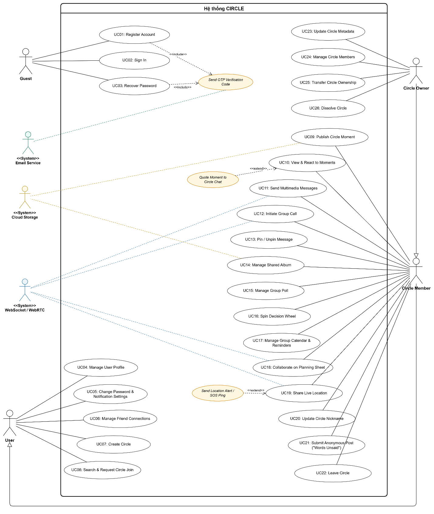

# CIRCLE — TÀI LIỆU ĐẶC TẢ USE CASE (USE CASE SPECIFICATIONS)

> **Tài liệu thuộc phân hệ:** Software Requirements Specification (SRS) & Phân tích thiết kế hệ thống CIRCLE.  
> **Căn cứ yêu cầu:** Báo cáo Tiểu luận chuyên ngành (TLCN) & [PROJECT_GOD.md](../../PROJECT_GOD.md).  
> **Sơ đồ Use Case tổng quát (XML Model):** [diagrams/usecase.xml](diagrams/usecase.xml)

---

## 1. Mô hình hóa yêu cầu & Nhận diện tác nhân

## Mô hình hóa yêu cầu

### Nhận diện tác nhân và chức năng trong sơ đồ use case

Dựa trên yêu cầu nghiệp vụ của hệ thống Circle, các tác nhân tham gia vào hệ thống được chia thành hai nhóm chính: tác nhân người dùng trực tiếp và tác nhân/hệ thống hỗ trợ bên ngoài. Mỗi tác nhân sẽ tương tác với hệ thống thông qua các chức năng phù hợp với vai trò, quyền hạn và phạm vi công việc của mình.

Bảng 2.1. Các tác nhân và chức năng trong sơ đồ Use case

| **Tác nhân**                                | **Chức năng**                                                                                                                                                                                                                                                                                                                                                                                                                                                                                                                                                                  |
| ------------------------------------------- | ------------------------------------------------------------------------------------------------------------------------------------------------------------------------------------------------------------------------------------------------------------------------------------------------------------------------------------------------------------------------------------------------------------------------------------------------------------------------------------------------------------------------------------------------------------------------------ |
| **Khách vãng lai** (Guest)                  | \- Register Account (UC01)  \- Sign In (UC02)  \- Recover Password (UC03)                                                                                                                                                                                                                                                                                                                                                                                                                                                                                          |
| **Người dùng** (User)                       | \- Manage User Profile (UC04)  \- Change Password & Notification Settings (UC05)  \- Manage Friend Connections (UC06)  \- Create Circle (UC07)  \- Search & Request Circle Join (UC08)                                                                                                                                                                                                                                                                                                                                                                 |
| **Thành viên nhóm** (Circle Member)         | \- Publish Circle Moment (UC09)  \- View & React to Moments (UC10)  \- Send Multimedia Messages (UC11)  \- Initiate Group Call (UC12)  \- Pin / Unpin Message (UC13)  \- Manage Shared Album (UC14)  \- Manage Group Poll (UC15)  \- Spin Decision Wheel (UC16)  \- Manage Group Calendar & Reminders (UC17)  \- Collaborate on Planning Sheet (UC18)  \- Share Live Location (UC19)  \- Update Circle Nickname (UC20)  \- Submit Anonymous Post ("Words Unsaid") (UC21)  \- Leave Circle (UC22) |
| **Trưởng nhóm** (Circle Owner)              | \- Update Circle Metadata (UC23)  \- Manage Circle Members (UC24)  \- Transfer Circle Ownership (UC25)  \- Dissolve Circle (UC26)                                                                                                                                                                                                                                                                                                                                                                                                                            |
| **Hệ thống Email** (Email Service)          | \- Send OTP Verification Code                                                                                                                                                                                                                                                                                                                                                                                                                                                                                                                                                  |
| **Hệ thống WebSocket / WebRTC**             | \- Real-time synchronization (Chat, Planning Sheet, Live Location, Group Calls)                                                                                                                                                                                                                                                                                                                                                                                                                                                                                                |
| **Dịch vụ Lưu trữ Đám mây** (Cloud Storage) | \- Media storage & processing (Moments, Shared Albums, Attachments)                                                                                                                                                                                                                                                                                                                                                                                                                                                                                                            |

---

## 2. Sơ đồ Use Case tổng quát

Mô hình sơ đồ Use Case đầy đủ của hệ thống CIRCLE được thiết kế bằng chuẩn draw.io / XML và lưu trữ tại:
- **Tệp nguồn sơ đồ:** [`diagrams/usecase.xml`](diagrams/usecase.xml)
- **Tệp hình ảnh kết xuất:** [`diagrams/usecase.png`](diagrams/usecase.png)
- **Cấu trúc phân vùng:** Swimlane bao gồm 4 nhóm tác nhân người dùng (Guest, User, Circle Member, Circle Owner), 3 hệ thống/dịch vụ ngoài (Email Service, WebSocket/WebRTC, Cloud Storage), và 26 Use Case chính (UC01 đến UC26).

---

## 3. Danh mục đặc tả Use Case chi tiết (UC01 — UC26)

### Đặc tả Use case

#### 2.3.1. Use case Register Account

**Bảng 2.1. Mô tả use case Register Account**

| **Use Case: UC01: Register Account** | |
| --- | | --- |
| **Mô tả** | Cho phép khách vãng lai đăng ký tài khoản mới trên hệ thống bằng thông tin cá nhân. Hệ thống gửi mã xác minh OTP qua email để người dùng kích hoạt tài khoản trước khi đăng nhập. |
| **Tác nhân kích hoạt** | Khách vãng lai (Guest) |
| **Tiền điều kiện** | • Người dùng chưa đăng nhập hệ thống.  • Email đăng ký chưa tồn tại trên hệ thống. |
| **Hậu điều kiện** | • **Thành công:** Tài khoản được tạo và kích hoạt thành công, chuyển đến màn hình đăng nhập.  • **Thất bại:** Tài khoản dừng ở trạng thái chưa xác minh (Pending) hoặc bị hủy bỏ (Rollback) nếu xảy ra lỗi hệ thống. |
| **Các bước thực hiện** | (1) Người dùng chọn chức năng "Đăng ký" trên màn hình khởi động.  (2) Hệ thống hiển thị biểu mẫu nhập: Họ tên, Email, Mật khẩu, Xác nhận mật khẩu.  (3) Người dùng nhập đầy đủ thông tin và gửi yêu cầu đăng ký.  (4) Hệ thống kiểm tra dữ liệu, tạo tài khoản tạm thời và gửi mã OTP qua email.  (5) Hệ thống chuyển sang màn hình nhập mã xác thực OTP.  (6) Người dùng nhập mã OTP nhận được từ email và xác nhận.  (7) Hệ thống kiểm tra mã OTP; nếu chính xác, kích hoạt tài khoản thành công.  (8) Hệ thống điều hướng người dùng sang màn hình Đăng nhập. |
| **Luồng thay thế** | **A1. Thông tin không hợp lệ:**  • 4a. Hệ thống phát hiện trường dữ liệu để trống hoặc mật khẩu không đủ độ dài an toàn.  • 4b. Hệ thống thông báo lỗi tương ứng và yêu cầu chỉnh sửa.  • 4c. Người dùng cập nhật lại thông tin và gửi lại yêu cầu.  **A2. Email đã tồn tại:**  • 4a. Hệ thống phát hiện email đã được sử dụng.  • 4b. Hệ thống thông báo email đã tồn tại và gợi ý đăng nhập hoặc dùng email khác.  **A3. Mã OTP sai hoặc hết hạn:**  • 7a. Hệ thống phát hiện mã OTP không đúng hoặc quá thời gian hiệu lực.  • 7b. Hệ thống thông báo lỗi và yêu cầu nhập lại hoặc gửi lại mã mới. |

2.3.2. Use case Sign In

**Bảng 2.2. Mô tả use case Sign In**

| **Use Case: UC02: Sign In** | |
| --- | | --- |
| **Mô tả** | Xác thực danh tính người dùng bằng Email và Mật khẩu, cấp mã định danh phiên làm việc (Access Token) để cấp quyền truy cập hệ thống. |
| **Tác nhân kích hoạt** | Khách vãng lai (Guest) |
| **Tiền điều kiện** | • Tài khoản đã đăng ký và kích hoạt email thành công. |
| **Hậu điều kiện** | • **Thành công:** Cấp mã phiên truy cập, người dùng chuyển sang vai trò User và được đưa vào trang chính.  • **Thất bại:** Từ chối truy cập, giữ nguyên giao diện và hiển thị thông báo lỗi. |
| **Các bước thực hiện** | (1) Người dùng chọn chức năng "Đăng nhập".  (2) Hệ thống hiển thị biểu mẫu gồm Email và Mật khẩu.  (3) Người dùng nhập thông tin tài khoản và nhấn "Đăng nhập".  (4) Hệ thống đối soát thông tin với cơ sở dữ liệu.  (5) Hệ thống tạo Token xác thực, lưu phiên làm việc và chuyển vào màn hình chính. |
| **Luồng thay thế** | **A1. Sai email hoặc mật khẩu:**  • 4a. Hệ thống phát hiện email không tồn tại hoặc mật khẩu không khớp.  • 4b. Hệ thống hiển thị thông báo lỗi và yêu cầu nhập lại.  **A2. Tài khoản chưa kích hoạt:**  • 4a. Hệ thống phát hiện tài khoản chưa hoàn tất xác thực email.  • 4b. Hệ thống tự động chuyển hướng sang màn hình nhập mã OTP để kích hoạt.  **A3. Tài khoản bị tạm khóa:**  • 4a. Hệ thống phát hiện tài khoản bị khóa do vi phạm hoặc nhập sai nhiều lần.  • 4b. Hệ thống từ chối đăng nhập và hiển thị hướng dẫn hỗ trợ. |

2.3.3. Use case Recover Password

**Bảng 2.3. Mô tả use case Recover Password**

| **Use Case: UC03: Recover Password** | |
| --- | | --- |
| **Mô tả** | Hỗ trợ người dùng đặt lại mật khẩu mới khi bị quên thông qua mã xác nhận bảo mật gửi về email đã đăng ký. |
| **Tác nhân kích hoạt** | Khách vãng lai (Guest) |
| **Tiền điều kiện** | • Email yêu cầu khôi phục phải tồn tại trên hệ thống. |
| **Hậu điều kiện** | • **Thành công:** Mật khẩu mới được cập nhật mã hóa trong cơ sở dữ liệu, hủy các phiên đăng nhập cũ.  • **Thất bại:** Mật khẩu cũ không thay đổi. |
| **Các bước thực hiện** | (1) Người dùng chọn "Quên mật khẩu?" tại màn hình đăng nhập.  (2) Hệ thống yêu cầu nhập địa chỉ Email đã đăng ký.  (3) Người dùng nhập email và bấm "Gửi mã xác nhận".  (4) Hệ thống kiểm tra email và gửi mã xác thực gồm 6 số.  (5) Người dùng nhập mã xác thực và thiết lập mật khẩu mới kèm xác nhận mật khẩu.  (6) Hệ thống kiểm tra mã hợp lệ, cập nhật mật khẩu mới và thông báo thành công.  (7) Hệ thống chuyển hướng về màn hình đăng nhập. |
| **Luồng thay thế** | **A1. Email không tồn tại:**  • 4a. Hệ thống không tìm thấy tài khoản với email đã nhập.  • 4b. Hệ thống thông báo lỗi và yêu cầu kiểm tra lại.  **A2. Mã xác nhận không đúng hoặc hết hạn:**  • 6a. Hệ thống phát hiện mã xác nhận không hợp lệ.  • 6b. Hệ thống thông báo lỗi và cho phép yêu cầu gửi lại mã mới. |

2.3.4. Use case Manage User Profile

**Bảng 2.4. Mô tả use case Manage User Profile**

| **Use Case: UC04: Manage User Profile** | |
| --- | | --- |
| **Mô tả** | Cho phép người dùng cập nhật hồ sơ cá nhân bao gồm: tên hiển thị, ảnh đại diện, tiểu sử và trạng thái hoạt động. |
| **Tác nhân kích hoạt** | Người dùng (User) |
| **Tiền điều kiện** | • Người dùng đã đăng nhập vào hệ thống. |
| **Hậu điều kiện** | • **Thành công:** Thông tin cá nhân mới được cập nhật trên toàn hệ thống và hiển thị cho bạn bè.  • **Thất bại:** Thông tin cũ được giữ nguyên, báo lỗi cập nhật. |
| **Các bước thực hiện** | (1) Người dùng vào mục "Hồ sơ cá nhân" và chọn "Chỉnh sửa hồ sơ".  (2) Hệ thống hiển thị biểu mẫu chứa các thông tin hiện tại.  (3) Người dùng thay đổi ảnh đại diện, tên hiển thị, lời giới thiệu hoặc trạng thái.  (4) Người dùng nhấn "Lưu thay đổi".  (5) Hệ thống kiểm tra tính hợp lệ của tệp ảnh và độ dài ký tự, lưu dữ liệu và thông báo cập nhật thành công. |
| **Luồng thay thế** | **A1. Định dạng ảnh không hỗ trợ hoặc dung lượng quá lớn:**  • 5a. Hệ thống phát hiện tệp ảnh vượt quá 5MB hoặc sai định dạng.  • 5b. Hệ thống hiển thị cảnh báo và yêu cầu chọn lại tệp ảnh hợp lệ.  **A2. Tên hiển thị để trống:**  • 5a. Người dùng xóa trống trường tên hiển thị.  • 5b. Hệ thống yêu cầu tên hiển thị phải có ít nhất 1 ký tự. |

2.3.5. Use case Change Password & Notification Settings

**Bảng 2.5. Mô tả use case Change Password & Notification Settings**

| **Use Case: UC05: Change Password & Notification Settings** | |
| --- | | --- |
| **Mô tả** | Cho phép người dùng đổi mật khẩu đăng nhập định kỳ và tùy chỉnh bật/tắt nhận thông báo đẩy (tin nhắn nhóm, nhắc lịch hẹn, bài đăng mới). |
| **Tác nhân kích hoạt** | Người dùng (User) |
| **Tiền điều kiện** | • Người dùng đã đăng nhập hệ thống. |
| **Hậu điều kiện** | • **Thành công:** Mật khẩu mới hoặc cấu hình nhận thông báo được lưu lại thành công.  • **Thất bại:** Giữ nguyên trạng thái cài đặt trước đó. |
| **Các bước thực hiện** | (1) Người dùng vào mục "Cài đặt & Bảo mật".  (2) Để đổi mật khẩu: Người dùng nhập mật khẩu hiện tại, mật khẩu mới và xác nhận mật khẩu mới rồi nhấn "Đổi mật khẩu".  (3) Hệ thống xác thực mật khẩu cũ và lưu mật khẩu mới đã mã hóa.  (4) Để cài đặt thông báo: Người dùng gạt bật/tắt các công tắc thông báo (thông báo âm thanh, rung, xem trước tin nhắn) và hệ thống lưu tự động. |
| **Luồng thay thế** | **A1. Nhập sai mật khẩu hiện tại:**  • 3a. Hệ thống đối soát thấy mật khẩu cũ không khớp.  • 3b. Hệ thống từ chối cập nhật và yêu cầu nhập lại đúng mật khẩu.  **A2. Mật khẩu mới trùng mật khẩu cũ:**  • 3a. Người dùng nhập mật khẩu mới giống hệt mật khẩu hiện tại.  • 3b. Hệ thống cảnh báo mật khẩu mới phải khác mật khẩu cũ. |

2.3.6. Use case Manage Friend Connections

**Bảng 2.6. Mô tả use case Manage Friend Connections**

| **Use Case: UC06: Manage Friend Connections** | |
| --- | | --- |
| **Mô tả** | Cho phép tìm kiếm người dùng khác qua email/tên, gửi lời mời kết bạn, đồng ý/từ chối lời mời hoặc hủy kết bạn để thuận tiện thêm vào các Circle. |
| **Tác nhân kích hoạt** | Người dùng (User) |
| **Tiền điều kiện** | • Người dùng đã đăng nhập hệ thống. |
| **Hậu điều kiện** | • **Thành công:** Mối quan hệ bạn bè được thiết lập hoặc gỡ bỏ trong danh bạ hệ thống. |
| **Các bước thực hiện** | (1) Người dùng vào mục "Bạn bè" và nhập từ khóa tìm kiếm (email/tên).  (2) Hệ thống trả về danh sách tài khoản phù hợp.  (3) Người dùng bấm "Kết bạn" đối với tài khoản mong muốn.  (4) Hệ thống gửi thông báo yêu cầu kết bạn đến tài khoản nhận.  (5) Người nhận mở danh sách yêu cầu và chọn "Chấp nhận" hoặc "Từ chối".  (6) Nếu chấp nhận, hệ thống lưu trạng thái là bạn bè và đưa vào danh sách liên hệ. |
| **Luồng thay thế** | **A1. Hủy lời mời kết bạn đã gửi:**  • 3a. Người dùng bấm vào nút "Đã gửi lời mời".  • 3b. Hệ thống thu hồi lời mời kết bạn.  **A2. Hủy kết bạn (Unfriend):**  • 1a. Người dùng chọn một người trong danh sách bạn bè và bấm "Hủy kết bạn".  • 1b. Hệ thống xóa quan hệ liên kết bạn bè giữa hai tài khoản. |

2.3.7. Use case Create Circle

**Bảng 2.7. Mô tả use case Create Circle**

| **Use Case: UC07: Create Circle** | |
| --- | | --- |
| **Mô tả** | Khởi tạo một không gian Circle mới. Người tạo tự động trở thành Circle Owner duy nhất và mời bạn bè vào không gian này. |
| **Tác nhân kích hoạt** | Người dùng (User) |
| **Tiền điều kiện** | • Người dùng đã đăng nhập hệ thống. |
| **Hậu điều kiện** | • **Thành công:** Circle được tạo, người tạo trở thành Circle Owner, gửi lời mời đến bạn bè được chọn và mở giao diện nhóm.  • **Thất bại:** Hệ thống hủy tác vụ, hiển thị lỗi. |
| **Các bước thực hiện** | (1) Người dùng bấm biểu tượng "Tạo Circle mới".  (2) Hệ thống hiển thị biểu mẫu: Tên nhóm (bắt buộc), Ảnh đại diện/bìa nhóm, Mô tả mục đích nhóm, Số lượng người.  (3) Người dùng điền thông tin và bấm "Tiếp tục".  (4) Hệ thống hiển thị danh sách bạn bè để chọn mời.  (5) Người dùng chọn bạn bè và bấm "Xác nhận tạo".  (6) Hệ thống kiểm tra tổng sĩ số, khởi tạo nhóm, gán quyền Circle Owner và mở màn hình nhóm. |
| **Luồng thay thế** | **A1. Không chọn thành viên ngay:**  • 4a. Người dùng bỏ qua bước chọn bạn bè từ danh bạ.  • 4b. Hệ thống khởi tạo Circle với 1 thành viên duy nhất (N=1) chờ mời sau.  **A2. Vượt quá giới hạn số lượng thành viên :**  • 6a. Hệ thống phát hiện tổng số thành viên vượt quá số người quy định.  • 6b. Hệ thống cảnh báo: "Mỗi Circle chỉ tối đa số thành viên để đảm bảo tính gắn kết. Vui lòng bỏ chọn bớt thành viên."  • 6c. Người dùng giảm bớt số lượng bạn bè và xác nhận lại. |

2.3.8. Use case Search & Request Circle Join

**Bảng 2.8. Mô tả use case Search & Request Circle Join**

| **Use Case: UC08: Search & Request Circle Join** | |
| --- | | --- |
| **Mô tả** | Cho phép người dùng tìm kiếm Circle qua mã định danh (Circle ID) hoặc truy cập qua đường dẫn mời (Invite Link) để gửi yêu cầu gia nhập nhóm. |
| **Tác nhân kích hoạt** | Người dùng (User) |
| **Tiền điều kiện** | • Người dùng đã đăng nhập và chưa phải là thành viên của Circle đó. |
| **Hậu điều kiện** | • **Thành công:** Yêu cầu gia nhập được chuyển vào hàng đợi duyệt của Circle Owner.  • **Thất bại:** Không gửi được yêu cầu do nhóm đã đầy hoặc mã không hợp lệ. |
| **Các bước thực hiện** | (1) Người dùng nhập mã Circle ID vào ô tìm kiếm hoặc nhấn vào đường link mời được chia sẻ.  (2) Hệ thống truy xuất và hiển thị thông tin tóm tắt: Tên Circle, Avatar, số lượng thành viên hiện tại.  (3) Người dùng bấm nút "Xin tham gia Circle".  (4) Hệ thống ghi nhận yêu cầu và gửi thông báo chờ duyệt đến Circle Owner. |
| **Luồng thay thế** | **A1. Circle đã đủ số thành viên:**  • 2a. Hệ thống nhận diện Circle đã đạt sĩ số tối đa.  • 2b. Hệ thống vô hiệu hóa nút gửi yêu cầu và thông báo Circle đã đủ thành viên.  **A2. Đã có yêu cầu đang chờ xử lý:**  • 3a. Người dùng đã bấm gửi trước đó.  • 3b. Hệ thống hiển thị trạng thái "Đang chờ duyệt" và không cho gửi lặp lại. |

2.3.9. Use case Publish Circle Moment

**Bảng 2.9. Mô tả use case Publish Circle Moment**

| **Use Case: UC09: Publish Circle Moment** | |
| --- | | --- |
| **Mô tả** | Cho phép thành viên chụp hoặc tải ảnh khoảnh khắc trực tiếp trong ngày lên bảng tin riêng của Circl. |
| **Tác nhân kích hoạt** | Thành viên nhóm (Circle Member) |
| **Tiền điều kiện** | • Là thành viên hợp lệ của Circle.  • Đã cấp quyền truy cập Camera/Thư viện ảnh trên thiết bị. |
| **Hậu điều kiện** | • **Thành công:** Khoảnh khắc được tải lên, hiển thị trên khay Moment của nhóm và gửi thông báo đến các thành viên.  • **Thất bại:** Tải ảnh thất bại do lỗi mạng, cho phép thử lại. |
| **Các bước thực hiện** | (1) Thành viên vào Circle, bấm vào biểu tượng "Đăng Moment".  (2) Người dùng chụp ảnh trực tiếp từ camera hoặc chọn ảnh từ thiết bị, thêm dòng chú thích ngắn.  (3) Người dùng bấm nút "Chia sẻ".  (4) Hệ thống nén ảnh, lưu tệp lên hệ thống đám mây và lưu bản ghi gắn liền với CircleID.  (5) Hệ thống cập nhật khoảnh khắc mới lên đầu bảng tin Circle và gửi thông báo đẩy đến các thành viên. |
| **Luồng thay thế** | **A1. Tệp vượt quá dung lượng cho phép (>10MB):**  • 3a. Hệ thống phát hiện tệp ảnh quá lớn.  • 3b. Hệ thống thông báo lỗi và yêu cầu chọn ảnh khác hoặc nén tệp. |

2.3.10. Use case View & React to Moments

**Bảng 2.10. Mô tả use case View & React to Moments**

| **Use Case: UC10: View & React to Moments** | |
| --- | | --- |
| **Mô tả** | Cho phép thành viên xem các ảnh khoảnh khắc của các bạn trong nhóm, gửi biểu tượng cảm xúc (Reaction) hoặc phản hồi khoảnh khắc trực tiếp vào khung chat nhóm.. |
| **Tác nhân kích hoạt** | Thành viên nhóm (Circle Member) |
| **Tiền điều kiện** | • Là thành viên của Circle. |
| **Hậu điều kiện** | • **Thành công:** Lượt thả cảm xúc hoặc bình luận hiển thị theo thời gian thực cho mọi thành viên trong Circle.  • **Thất bại:** Dữ liệu tương tác không được lưu do mất kết nối. |
| **Các bước thực hiện** | (1) Thành viên mở mục Moment trên giao diện Circle.  (2) Hệ thống hiển thị tuần tự các hình ảnh khoảnh khắc của các thành viên.  (3) Người dùng bấm chọn các biểu tượng cảm xúc nhanh hoặc chạm vào khung bình luận.  (4) Người dùng nhập nội dung và bấm gửi bình luận.  (5) Hệ thống cập nhật bình luận dưới Moment và phát thông báo qua WebSocket đến các thành viên trong nhóm. |
| **Luồng thay thế** | **A1. Rút lại hoặc đổi cảm xúc:**  • 3a. Người dùng bấm lại vào cảm xúc đã chọn để hủy, hoặc chọn biểu tượng mới.  • 3b. Hệ thống cập nhật giảm hoặc đổi loại biểu tượng tương ứng trên giao diện chung.  **A2. Moment đã bị tác giả xóa:**  • 3a. Người dùng tương tác vào ảnh vừa bị xóa.  • 3b. Hệ thống thông báo khoảnh khắc không còn khả dụng và làm mới bảng tin. |

2.3.11. Use case Send Multimedia Messages

**Bảng 2.11. Mô tả use case Send Multimedia Messages**

| **Use Case: UC11: Send Multimedia Messages** | |
| --- | | --- |
| **Mô tả** | Cho phép các thành viên trao đổi tin nhắn trò chuyện đa phương tiện trong nhóm, bao gồm: văn bản, hình ảnh, tập tin tài liệu và tin nhắn thoại. |
| **Tác nhân kích hoạt** | Thành viên nhóm (Circle Member) |
| **Tiền điều kiện** | • Là thành viên của Circle và đang tham gia phòng chat nhóm. |
| **Hậu điều kiện** | • **Thành công:** Tin nhắn được lưu vào cơ sở dữ liệu và đồng bộ tức thời đến cửa sổ chat của tất cả thành viên.  • **Thất bại:** Tin nhắn hiển thị trạng thái gửi lỗi kèm biểu tượng thử lại. |
| **Các bước thực hiện** | (1) Thành viên truy cập khung chat của Circle.  (2) Người dùng nhập nội dung tin nhắn hoặc đính kèm ảnh/tệp/thu âm giọng nói.  (3) Người dùng bấm nút "Gửi".  (4) Hệ thống mã hóa thông điệp, lưu vào bảng tin nhắn theo CircleID và phát sóng qua kênh thời gian thực (Socket).  (5) Giao diện người nhận tự động hiển thị tin nhắn mới mà không cần tải lại trang. |
| **Luồng thay thế** | **A1. Tệp đính kèm vượt quá giới hạn (>25MB):**  • 2a. Hệ thống kiểm tra dung lượng tệp vượt ngưỡng.  • 2b. Hệ thống từ chối tải tệp và yêu cầu chọn tệp có kích thước nhỏ hơn. |

2.3.12. Use case Initiate Group Call

**Bảng 2.12. Mô tả use case Initiate Group Call**

| **Use Case: UC12: Initiate Group Call** | |
| --- | | --- |
| **Mô tả** | Khởi tạo hoặc tham gia vào phiên gọi thoại (Voice call) hoặc gọi video đa thành viên theo thời gian thực bên trong Circle. |
| **Tác nhân kích hoạt** | Thành viên nhóm (Circle Member) |
| **Tiền điều kiện** | • Thiết bị đã cấp quyền sử dụng Micro và Camera.  • Kết nối mạng Internet ổn định. |
| **Hậu điều kiện** | • **Thành công:** Phiên gọi nhóm thời gian thực (WebRTC) được kết nối giữa các thành viên tham gia.  • **Thất bại:** Cuộc gọi bị hủy hoặc ngắt kết nối do lỗi truyền dẫn. |
| **Các bước thực hiện** | (1) Thành viên bấm biểu tượng Gọi thoại hoặc Gọi video ở thanh điều hướng nhóm.  (2) Hệ thống khởi tạo phòng gọi trực tuyến và gửi tín hiệu đổ chuông đến tất cả thành viên trong Circle.  (3) Các thành viên khác bấm nút "Tham gia".  (4) Hệ thống kết nối luồng âm thanh và hình ảnh đa điểm giữa các thành viên.  (5) Khi kết thúc, người dùng bấm "Rời phòng gọi". Phiên gọi tự động đóng khi người cuối cùng rời đi. |
| **Luồng thay thế** | **A1. Cuộc gọi không có ai tham gia:**  • 2a. Hệ thống duy trì tín hiệu chuông tối đa 60 giây.  • 2b. Nếu không ai bắt máy, hệ thống tự động kết thúc và ghi thông báo "Cuộc gọi nhỡ" trong khung chat. |

2.3.13. Use case Pin / Unpin Message

**Bảng 2.13. Mô tả use case Pin / Unpin Message**

| **Use Case: UC13: Pin / Unpin Message** | |
| --- | | --- |
| **Mô tả** | Cho phép ghim các tin nhắn quan trọng, thông báo hoặc đường dẫn cần thiết lên thanh tiêu đề đầu khung chat của nhóm, hoặc gỡ ghim khi nội dung hết hiệu lực. |
| **Tác nhân kích hoạt** | Thành viên nhóm (Circle Member) |
| **Tiền điều kiện** | • Là thành viên Circle và tin nhắn được chọn đang tồn tại trong đoạn chat. |
| **Hậu điều kiện** | • **Thành công:** Tin nhắn được đưa vào thanh ghim đầu màn hình chat cho toàn bộ thành viên cùng thấy. |
| **Các bước thực hiện** | (1) Thành viên nhấn giữ vào một tin nhắn trong đoạn chat nhóm.  (2) Chọn mục "Ghim tin nhắn".  (3) Hệ thống hiển thị hộp thoại xác nhận: "Ghim tin nhắn này cho tất cả mọi người?".  (4) Người dùng bấm "Xác nhận".  (5) Hệ thống cập nhật trạng thái tin nhắn và hiển thị nội dung tóm tắt trên thanh ghim cố định của nhóm. |
| **Luồng thay thế** | **A1. Bỏ ghim tin nhắn:**  • 1a. Người dùng bấm vào danh sách tin ghim và chọn "Bỏ ghim".  • 1b. Hệ thống gỡ bỏ tin nhắn khỏi thanh thông báo đầu trang. |

2.3.14. Use case Manage Shared Album

**Bảng 2.14. Mô tả use case Manage Shared Album**

| **Use Case: UC14: Manage Shared Album** | |
| --- | | --- |
| **Mô tả** | Cung cấp kho lưu trữ hình ảnh/video chung của Circle, cho phép tạo các album theo chủ đề (du lịch, kỷ niệm), tải lên ảnh chất lượng cao và tải ảnh về thiết bị. |
| **Tác nhân kích hoạt** | Thành viên nhóm (Circle Member) |
| **Tiền điều kiện** | • Là thành viên của Circle. |
| **Hậu điều kiện** | • **Thành công:** Album/ảnh mới được tải lên và lưu trữ theo nhóm.  • **Thất bại:** Báo lỗi tải tệp, ảnh không hiển thị trong album. |
| **Các bước thực hiện** | (1) Thành viên chuyển sang mục "Kho lưu trữ" -> chọn "Album ảnh".  (2) Người dùng bấm "Tạo Album mới", nhập tên chủ đề (ví dụ: "Chuyến đi Đà Lạt").  (3) Người dùng bấm "Thêm ảnh" và chọn các tệp ảnh từ thiết bị.  (4) Bấm "Tải lên".  (5) Hệ thống lưu trữ các tập tin, gắn với AlbumID và hiển thị danh mục ảnh trong nhóm. |
| **Luồng thay thế** | **A1. Xóa ảnh trong Album:**  • 2a. Thành viên mở xem ảnh do chính mình đăng tải và chọn "Xóa".  • 2b. Hệ thống xóa tệp ảnh khỏi album và cập nhật lại giao diện. |

2.3.15. Use case Manage Group Poll

**Bảng 2.15. Mô tả use case Manage Group Poll**

| **Use Case: UC15: Manage Group Poll** | |
| --- | | --- |
| **Mô tả** | Tạo các cuộc thăm dò ý kiến/biểu quyết tập thể với tùy chọn đơn/nhiều lựa chọn để lấy biểu quyết số đông của các thành viên trong nhóm. |
| **Tác nhân kích hoạt** | Thành viên nhóm (Circle Member) |
| **Tiền điều kiện** | • Là thành viên của Circle. |
| **Hậu điều kiện** | • **Thành công:** Cuộc bình chọn được tạo trong khung chat, cập nhật tỷ lệ phần trăm biểu quyết theo thời gian thực. |
| **Các bước thực hiện** | (1) Thành viên bấm vào biểu tượng tiện ích -> chọn "Tạo bình chọn".  (2) Hệ thống mở biểu mẫu: Câu hỏi thăm dò, Các phương án lựa chọn, Tùy chọn cho phép chọn nhiều phương án hoặc thêm lựa chọn mới.  (3) Người dùng nhập nội dung và bấm "Đăng bình chọn".  (4) Hệ thống hiển thị bảng bình chọn vào phòng chat.  (5) Các thành viên tích chọn phương án của mình và bấm "Biểu quyết".  (6) Hệ thống tính toán lại tỷ lệ và cập nhật thanh tiến độ hiển thị cho cả nhóm. |
| **Luồng thay thế** | **A1. Thay đổi phương án bầu:**  • 5a. Thành viên bấm "Đổi bình chọn".  • 5b. Hệ thống cho phép chọn phương án khác và cập nhật lại số liệu. |

2.3.16. Use case Spin Decision Wheel

**Bảng 2.16. Mô tả use case Spin Decision Wheel**

| **Use Case: UC16: Spin Decision Wheel** | |
| --- | | --- |
| **Mô tả** | Cung cấp công cụ Vòng xoay may mắn ngẫu nhiên, cho phép các thành viên cấu hình các tùy chọn (ăn gì, ai trả tiền, ai làm việc nhà) và quay đồng bộ cùng xem kết quả. |
| **Tác nhân kích hoạt** | Thành viên nhóm (Circle Member) |
| **Tiền điều kiện** | • Là thành viên của Circle. |
| **Hậu điều kiện** | • **Thành công:** Vòng xoay quay đồng bộ trên màn hình các thành viên và công bố kết quả trúng vào khung chat. |
| **Các bước thực hiện** | (1) Thành viên mở tiện ích "Vòng xoay may mắn".  (2) Người dùng nhập danh sách các ô lựa chọn (ví dụ: Tên các món ăn) hoặc chọn mẫu có sẵn.  (3) Người dùng bấm nút "Bắt đầu quay".  (4) Hệ thống tạo giá trị ngẫu nhiên từ máy chủ, gửi tín hiệu đồng bộ góc quay và thời gian quay đến tất cả thành viên đang mở vòng xoay.  (5) Vòng xoay dừng lại tại ô trúng thưởng, hệ thống gửi thông báo kết quả chung cuộc vào nhóm. |
| **Luồng thay thế** | **A1. Không đủ số lượng ô lựa chọn:**  • 2a. Người dùng chỉ nhập 1 lựa chọn hoặc để trống.  • 2b. Hệ thống yêu cầu phải nhập tối thiểu 2 lựa chọn để có thể quay. |

2.3.17. Use case Manage Group Calendar & Reminders

**Bảng 2.17. Mô tả use case Manage Group Calendar & Reminders**

| **Use Case: UC17: Manage Group Calendar & Reminders** | |
| --- | | --- |
| **Mô tả** | Giao diện lịch biểu theo tháng/tuần, cho phép tạo các sự kiện hẹn mốc thời gian rõ ràng (hẹn ăn uống, sinh nhật, hạn nộp bài) kèm cơ chế gửi thông báo nhắc hẹn tự động. |
| **Tác nhân kích hoạt** | Thành viên nhóm (Circle Member) |
| **Tiền điều kiện** | • Là thành viên của Circle. |
| **Hậu điều kiện** | • **Thành công:** Sự kiện xuất hiện trên Lịch nhóm và lập lịch thông báo hẹn giờ cho từng thành viên. |
| **Các bước thực hiện** | (1) Thành viên vào mục "Lịch nhóm" (Group Calendar).  (2) Chọn một ngày trên giao diện lịch và bấm "Thêm sự kiện".  (3) Nhập thông tin: Tiêu đề sự kiện, Giờ bắt đầu/kết thúc, Địa điểm, Thời gian nhắc nhở (trước 15 phút, 1 tiếng, 1 ngày).  (4) Bấm "Lưu sự kiện".  (5) Hệ thống lưu trữ sự kiện và lập trình lịch chạy thông báo đến toàn bộ thành viên khi đến hạn. |
| **Luồng thay thế** | **A1. Thời gian sự kiện không hợp lệ:**  • 3a. Giờ kết thúc được chọn trước giờ bắt đầu.  • 3b. Hệ thống báo lỗi và yêu cầu điều chỉnh thời gian hợp lý.       **A2. Xóa sự kiện:**     • 1a. Thành viên mở xem chi tiết sự kiện và bấm "Xóa sự kiện".     • 1b. Hệ thống gỡ sự kiện khỏi lịch và hủy bỏ thông báo nhắc hẹn. |

2.3.18. Use case Collaborate on Planning Sheet

**Bảng 2.18. Mô tả use case Collaborate on Planning Sheet**

| **Use Case: UC18: Collaborate on Planning Sheet** | |
| --- | | --- |
| **Mô tả** | Cung cấp không gian làm việc dạng bảng tính linh hoạt (Dynamic Grid), cho phép mọi thành viên trong Circle tự do tạo bảng, thêm/xóa cột, thêm/xóa dòng và cùng chỉnh sửa nội dung văn bản trong các ô dữ liệu (Cells) theo thời gian thực mà không bị giới hạn bởi các trường thông tin cố định. |
| **Tác nhân kích hoạt** | Thành viên nhóm (Circle Member) |
| **Tiền điều kiện** | • Người dùng là thành viên hợp lệ của Circle.  • Bảng kế hoạch của Circle đang hoạt động hoặc được khởi tạo mới. |
| **Hậu điều kiện** | • **Thành công:** Dữ liệu chỉnh sửa (nội dung ô, trạng thái hoàn thành, thêm dòng) được lưu và đồng bộ tức thời đến màn hình của mọi thành viên đang theo dõi bảng.  • **Thất bại:** Thao tác bị gián đoạn do mất kết nối; hệ thống giữ lại bản nháp cục bộ và thông báo đồng bộ hóa thất bại. |
| **Các bước thực hiện** | **(1)** Thành viên truy cập vào phân hệ Bảng kế hoạch (Planning Sheet) của Circle.  **(2)** Hệ thống truy vấn và hiển thị ma trận bảng tính hiện tại gồm các Cột (SheetColumn), Hàng (SheetRow) và các Ô dữ liệu chuỗi (SheetCell).  **(3)** Thành viên nhấp chọn vào một ô bất kỳ trên lưới để nhập liệu (văn bản, số liệu hoặc ký tự tự do) hoặc chọn thao tác thêm hàng/thêm cột.  **(4)** Thành viên hoàn tất nhập nội dung ô và xác nhận bằng cách nhấn Enter hoặc nhấp ra ngoài ô (mất tiêu điểm/blur).  **(5)** Hệ thống xác thực dữ liệu chuỗi, cập nhật bản ghi SheetCell kèm định danh người sửa cuối cùng (last_edited_by) và thời điểm cập nhật.  **(6)** Hệ thống phát tín hiệu đồng bộ hóa qua giao thức WebSocket đến các máy khách khác trong nhóm.  **(7)** Màn hình của toàn bộ thành viên đang theo dõi bảng lập tức cập nhật giá trị mới của ô mà không cần tải lại trang. |
| **Luồng thay thế** | **A1. Tự do thêm hoặc đổi tên Cột (Add / Rename Column):**  • 3a. Thành viên nhấn nút "Thêm cột" hoặc nhấp đúp vào tiêu đề của một cột hiện có.  • 3b. Thành viên nhập tiêu đề mới cho cột và nhấn lưu.  • 3c. Hệ thống sinh thêm thuộc tính cột mới (SheetColumn), tự động mở rộng ma trận ô cho các hàng hiện hữu và đồng bộ cấu trúc mới cho cả nhóm.  **A2. Thêm hoặc xóa Dòng (Add / Delete Row):**  • 3a. Thành viên nhấn nút "Thêm dòng" ở cuối bảng hoặc chọn xóa một dòng không còn dùng.  • 3b. Hệ thống khởi tạo một hàng mới (SheetRow) với các ô dữ liệu trống hoặc gỡ bỏ các ô thuộc hàng đó, sau đó cập nhật tức thời cho các thành viên.  **A3. Xung đột chỉnh sửa đồng thời trên cùng một ô (Concurrent Edit Conflict):**  • 5a. Hệ thống phát hiện hai thành viên cùng chỉnh sửa và gửi dữ liệu về cùng một tọa độ ô (SheetCell) tại cùng một thời điểm.  • 5b. Hệ thống áp dụng quy tắc cập nhật theo mốc thời gian sau cùng (**Last-write-wins**), ghi nhận giá trị của người thao tác cuối và cập nhật lại thông tin last_edited_by cho toàn bộ nhóm. |

2.3.19. Use case Share Live Location

**Bảng 2.19. Mô tả use case Share Live Location**

| **Use Case: UC19: Share Live Location** | |
| --- | | --- |
| **Mô tả** | Cho phép thành viên chia sẻ vị trí địa lý thời gian thực của mình trên bản đồ nội bộ nhóm trong một khoảng thời gian nhất định (15 phút, 1 giờ) để phục vụ việc hẹn gặp, đưa đón. |
| **Tác nhân kích hoạt** | Thành viên nhóm (Circle Member) |
| **Tiền điều kiện** | • Thiết bị cấp quyền định vị GPS (Location Services).  • Là thành viên của Circle. |
| **Hậu điều kiện** | • **Thành công:** Tọa độ của thành viên hiển thị và di chuyển trực tiếp trên bản đồ số của nhóm.  • **Thất bại:** Không thể lấy tọa độ do tắt định vị GPS. |
| **Các bước thực hiện** | (1) Thành viên bấm tiện ích "Vị trí trực tiếp" trong nhóm.  (2) Chọn khoảng thời gian muốn chia sẻ (ví dụ: 15 phút, 1 giờ).  (3) Người dùng bấm "Bắt đầu chia sẻ".  (4) Ứng dụng liên tục lấy tọa độ GPS từ thiết bị và gửi về máy chủ theo chu kỳ định sẵn.  (5) Bản đồ nhóm của các thành viên khác hiển thị avatar của người dùng đang di chuyển tương ứng. |
| **Luồng thay thế** | **A1. Dừng chia sẻ trước hạn:**  • 3a. Người dùng bấm nút "Dừng chia sẻ vị trí"   • 3b. Hệ thống ngắt truyền tọa độ và gỡ biểu tượng vị trí khỏi bản đồ nhóm. |

2.3.20. Use case Update Circle Nickname

**Bảng 2.20. Mô tả use case Update Circle Nickname**

| **Use Case: UC20: Update Circle Nickname** | |
| --- | | --- |
| **Mô tả** | Cho phép thành viên (hoặc bạn bè) đặt hoặc đổi biệt danh riêng của mình trong một Circle cụ thể mà không làm ảnh hưởng đến tên hiển thị chung của tài khoản ngoài hệ thống. |
| **Tác nhân kích hoạt** | Thành viên nhóm (Circle Member) |
| **Tiền điều kiện** | • Là thành viên của Circle. |
| **Hậu điều kiện** | • **Thành công:** Tên hiển thị của thành viên trong các đoạn chat, khoảnh khắc, danh sách nhóm này được cập nhật theo biệt danh mới. |
| **Các bước thực hiện** | (1) Thành viên vào phần "Cài đặt nhóm" -> chọn "Biệt danh của tôi trong nhóm".  (2) Hệ thống hiển thị hộp thoại chứa biệt danh hiện tại.  (3) Người dùng nhập biệt danh mới (ví dụ: "Bếp trưởng", "Thủ quỹ") và bấm "Lưu".  (4) Hệ thống cập nhật trường nickname trong bảng thành viên nhóm.  (5) Hệ thống phát thông báo vào khung chat: "\[Tên cũ\] đã đổi biệt danh thành \[Tên mới\]". |
| **Luồng thay thế** | **A1. Xóa biệt danh:**  • 3a. Người dùng để trống ô nhập biệt danh và bấm lưu.  • 3b. Hệ thống khôi phục lại việc hiển thị tên tài khoản gốc. |

2.3.21. Use case Submit Anonymous Post ("Words Unsaid")

**Bảng 2.21. Mô tả use case Submit Anonymous Post ("Words Unsaid")**

| **Use Case: UC21: Submit Anonymous Post ("Words Unsaid")** | |
| --- | | --- |
| **Mô tả** | Cho phép thành viên gửi bài viết tâm sự hoặc chia sẻ ẩn danh vào chuyên mục "Điều muốn nói" của nhóm, danh tính người gửi được mã hóa và ẩn giấu hoàn toàn đối với cả nhóm và Trưởng nhóm. |
| **Tác nhân kích hoạt** | Thành viên nhóm (Circle Member) |
| **Tiền điều kiện** | • Là thành viên của Circle. |
| **Hậu điều kiện** | • **Thành công:** Bài viết ẩn danh xuất hiện trên bảng tin "Điều muốn nói" của nhóm mà không kèm theo bất kỳ thông tin nhận diện tác giả nào. |
| **Các bước thực hiện** | (1) Thành viên vào chuyên mục "Điều muốn nói" (Words Unsaid).  (2) Chọn "Gửi bài viết ẩn danh".  (3) Người dùng soạn thảo nội dung (tâm sự, góp ý, khen ngợi) và chọn màu thiệp/hình nền trang trí.  (4) Bấm "Gửi ẩn danh".  (5) Hệ thống kiểm tra nội dung, lược bỏ toàn bộ siêu dữ liệu (author_id) khi hiển thị ra phía ngoài và đăng bài viết vào bảng tin nhóm.  (6) Các thành viên khác có thể đọc và thả cảm xúc ẩn danh lên bài viết. |
| **Luồng thay thế** | **A1. Nội dung rỗng:**  • 3a. Người dùng chưa nhập ký tự nào.  • 3b. Hệ thống vô hiệu hóa nút gửi cho đến khi có nội dung hợp lệ. |

2.3.22. Use case Leave Circle

**Bảng 2.22. Mô tả use case Leave Circle**

| **Use Case: UC22: Leave Circle** | |
| --- | | --- |
| **Mô tả** | Cho phép thành viên tự nguyện rút khỏi Circle. Quyền truy cập vào các dữ liệu mới của nhóm bị thu hồi, nhưng lịch sử hoạt động cũ vẫn bảo lưu cho những người còn lại. |
| **Tác nhân kích hoạt** | Thành viên nhóm (Circle Member) |
| **Tiền điều kiện** | • Người dùng đang là thành viên của Circle mục tiêu. |
| **Hậu điều kiện** | • **Thành công:** Hủy bỏ tư cách thành viên, chuyển trạng thái LEFT, đóng quyền truy cập dữ liệu nhóm.    • **Thất bại:** Bị hệ thống chặn rời nếu đang là Circle Owner mà chưa bàn giao quyền. |
| **Các bước thực hiện** | (1) Thành viên vào "Cài đặt nhóm" -> chọn "Rời khỏi Circle".  (2) Hệ thống hiển thị hộp thoại cảnh báo về việc sẽ không thể truy cập lại nhóm nếu không được mời lại.  (3) Người dùng bấm "Xác nhận rời".  (4) Hệ thống chuyển trạng thái thành viên sang LEFT, ngắt phiên kết nối liên kết nhóm.  (5) Hệ thống phát tin nhắn tự động: "\[Tên người dùng\] đã rời khỏi nhóm" vào đoạn chat chung.  (6) Người dùng được chuyển về màn hình danh sách nhóm cá nhân. |
| **Luồng thay thế** | **A1. Circle Owner rời nhóm khi nhóm còn người (N>1):**  • 3a. Hệ thống phát hiện người yêu cầu rời nhóm là Circle Owner duy nhất.  • 3b. Hệ thống chặn rời nhóm và yêu cầu thực hiện use case UC25: Transfer Circle Ownership trước.  **A2. Thành viên cuối cùng rời nhóm (N=1):**  • 3a. Hệ thống cảnh báo việc rời nhóm sẽ xóa vĩnh viễn Circle này.  • 3b. Nếu người dùng tiếp tục, hệ thống chuyển sang tự động kích hoạt UC26: Dissolve Circle. |

2.3.23. Use case Update Circle Metadata

**Bảng 2.23. Mô tả use case Update Circle Metadata**

| **Use Case: UC23: Update Circle Metadata** | |
| --- | | --- |
| **Mô tả** | Cho phép Trưởng nhóm chỉnh sửa các thuộc tính cốt lõi của Circle: đổi tên nhóm, thay đổi ảnh đại diện/bìa, cập nhật tiểu sử giới thiệu và thiết lập chế độ duyệt thành viên (tự do vào hoặc phải duyệt). |
| **Tác nhân kích hoạt** | Trưởng nhóm (Circle Owner) |
| **Tiền điều kiện** | • Đang giữ vai trò Circle Owner của Circle đó. |
| **Hậu điều kiện** | • **Thành công:** Thông tin định danh mới của nhóm được cập nhật trên cơ sở dữ liệu và hiển thị ngay cho các thành viên. |
| **Các bước thực hiện** | (1) Circle Owner vào "Cài đặt nhóm" -> chọn "Chỉnh sửa thông tin Circle".  (2) Hệ thống mở giao diện biểu mẫu thông tin nhóm hiện tại.  (3) Owner thay đổi tên, tải ảnh đại diện mới hoặc chỉnh sửa đoạn mô tả.  (4) Bấm "Lưu thay đổi".  (5) Hệ thống kiểm tra dữ liệu hợp lệ và lưu cập nhật, gửi thông báo thay đổi đến các thành viên trong nhóm. |
| **Luồng thay thế** | **A1. Tên nhóm để trống:**  • 3a. Owner xóa trống tên nhóm.  • 3b. Hệ thống thông báo lỗi và yêu cầu phải có tên Circle. |

2.3.24. Use case Manage Circle Members

**Bảng 2.24. Mô tả use case Manage Circle Members**

| **Use Case: UC24: Manage Circle Members** | |
| --- | | --- |
| **Mô tả** | Cung cấp quyền kiểm duyệt thành viên cho Owner: phê duyệt hoặc từ chối các đơn xin vào nhóm, và trục xuất (xóa) những thành viên vi phạm quy tắc ra khỏi nhóm. |
| **Tác nhân kích hoạt** | Trưởng nhóm (Circle Owner) |
| **Tiền điều kiện** | • Đang giữ vai trò Circle Owner. |
| **Hậu điều kiện** | • **Thành công:** Thành viên mới được thêm vào hoặc thành viên bị chỉ định bị gạch tên khỏi danh sách nhóm. |
| **Các bước thực hiện** | _(Trường hợp xóa thành viên khỏi nhóm):_  (1) Owner mở mục "Quản lý thành viên" trong phần Cài đặt nhóm.  (2) Hệ thống liệt kê danh sách toàn bộ thành viên đang có mặt.  (3) Owner chọn biểu tượng tùy chọn bên cạnh tên thành viên cần loại và chọn "Mời ra khỏi nhóm".  (4) Hệ thống yêu cầu xác nhận hành động xóa.  (5) Owner nhấn "Xác nhận".  (6) Hệ thống hủy quyền thành viên của tài khoản đó, ngắt kết nối trực tuyến và cập nhật danh sách. |
| **Luồng thay thế** | **A1. Phê duyệt yêu cầu tham gia nhóm:**  • 1a. Owner chuyển sang tab "Yêu cầu chờ duyệt" -> chọn "Đồng ý" hoặc "Từ chối".  • 1b. Nếu đồng ý và sĩ số N≤Max, hệ thống đưa tài khoản vào nhóm làm Circle Member.  • 1c. Nếu nhóm đã đạt giới hạn người, hệ thống khóa duyệt và báo Circle đã đủ số lượng. |

2.3.25. Use case Transfer Circle Ownership

**Bảng 2.25. Mô tả use case Transfer Circle Ownership**

| **Use Case: UC25: Transfer Circle Ownership** | |
| --- | | --- |
| **Mô tả** | Cho phép Circle Owner chuyển giao toàn quyền quản trị nhóm cao nhất (Owner) cho một thành viên hoạt động khác trong Circle. |
| **Tác nhân kích hoạt** | Trưởng nhóm (Circle Owner) |
| **Tiền điều kiện** | • Đang giữ vai trò Circle Owner.  • Nhóm có ít nhất từ 2 thành viên trở lên. |
| **Hậu điều kiện** | • **Thành công:** Thành viên được chọn trở thành Circle Owner mới, Owner cũ hạ bậc trở thành Circle Member bình thường. |
| **Các bước thực hiện** | (1) Owner vào "Cài đặt nhóm" -> chọn "Chuyển quyền Trưởng nhóm".  (2) Hệ thống hiển thị danh sách các thành viên hiện tại trong nhóm.  (3) Owner chọn thành viên muốn giao quyền.  (4) Hệ thống hiển thị cảnh báo: "Bạn sẽ mất quyền Trưởng nhóm và trở thành thành viên thường. Hành động này không thể hoàn tác!".  (5) Owner nhập mật khẩu tài khoản để xác thực bảo mật và nhấn "Xác nhận chuyển nhượng".  (6) Hệ thống hoán đổi vai trò giữa 2 tài khoản trong cơ sở dữ liệu và thông báo vào đoạn chat chung. |
| **Luồng thay thế** | **A1. Nhập sai mật khẩu xác nhận:**  • 5a. Hệ thống kiểm tra mật khẩu không chính xác.  • 5b. Hệ thống từ chối chuyển quyền và yêu cầu xác thực lại. |

2.3.26. Use case Dissolve Circle

**Bảng 2.26. Mô tả use case Dissolve Circle**

| **Use Case: UC26: Dissolve Circle** | |
| --- | | --- |
| **Mô tả** | Cho phép Circle Owner giải tán nhóm hoàn toàn, chấm dứt hoạt động của Circle, thu hồi quyền truy cập của toàn bộ thành viên và đưa dữ liệu vào diện xóa/lưu trữ vĩnh viễn. |
| **Tác nhân kích hoạt** | Trưởng nhóm (Circle Owner) |
| **Tiền điều kiện** | • Đang giữ vai trò Circle Owner. |
| **Hậu điều kiện** | • **Thành công:** Circle bị đóng hoàn toàn khỏi hệ sinh thái hoạt động, hủy mọi quyền truy cập của các thành viên. |
| **Các bước thực hiện** | (1) Owner vào "Cài đặt nâng cao" của Circle -> chọn "Giải tán Circle" (Dissolve Circle).  (2) Hệ thống hiển thị hộp thoại cảnh báo: "Toàn bộ tin nhắn, lịch trình, ảnh và dữ liệu của nhóm sẽ bị xóa vĩnh viễn đối với tất cả thành viên."  (3) Owner nhập mã xác nhận (hoặc mật khẩu tài khoản) và bấm "Xác nhận giải tán".  (4) Hệ thống cập nhật cờ xóa is_deleted = true, thu hồi mọi token truy cập của các thành viên liên quan.  (5) Hệ thống điều hướng tất cả thành viên đang trực tuyến trong Circle ra màn hình chính và thông báo nhóm đã giải tán. |
| **Luồng thay thế** | **A1. Hủy bỏ thao tác:**  • 3a. Owner bấm "Hủy bỏ".  • 3b. Hệ thống đóng hộp thoại và giữ nguyên hiện trạng của Circle. |
